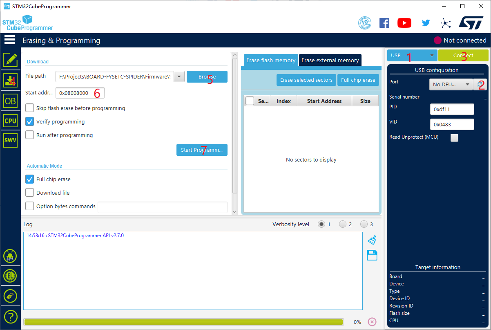

[1. Product Introduction](#1-product-introduction)

* [1.1 Change log](#11-change-log)
  - [1.1.1 Spider v1.1](#111-spider-v11)
  - [1.1.2 Spider v2.x](#112-spider-v2x)

[2. Features](#2-features)

[3. Hardware Guide](#3-hardware-guide)
* [3.1 Spider wiring](#31-spider-wiring)
* [3.2 Wiring : FYSETC mini 12864 v2.1](#32-wiring--fysetc-mini-12864-v21)
  * [注意/NOTICE：](#notice)
  * [Wiring](#wiring)
* [3.3 Wiring : TMC2209](#33-wiring--tmc2209)
* [3.4 Wiring : RaspberryPi](#34-wiring--raspberrypi)
* [3.5 Pin Out](#35-pin-out)
* [3.6 Pin Definition](#36-pin-definition)

[4. Firmware Guide](#4-firmware-guide)

* [4.1 Marlin](#41-marlin)
  - [4.1.1 Download Vscode + platformio](#411-download-vscode--platformio)
  - [4.1.2 Download firmware](#412-download-firmware)
  - [4.1.3 Compile the firmware](#413-Compile-the-firmware)
  - [4.1.4 Upload firmware](#414-Upload-the-firmware)
* [4.2 Klipper](#42-Klipper)
  * [4.2.1 menuconfig](#421-menuconfig)
  * [4.2.2 Compile firmware](#422-Compile-firmware)
  * [4.2.3 Upload firmware](#423-upload-firmware)
* [4.3 RRF](#43-rrf)
* [4.4  Firmware Upload](#44--firmware-upload)
  * [4.4.1 Upload the firmware(SDCARD)](#441-upload-the-firmwaresdcard)
  * [4.4.2 Upload the firmware(dfu-util)](#442-upload-the-firmwaredfu-util)
  * [4.4.3 Upload the firmware(DFU)](#443-upload-the-firmwaredfu)
    * [Step 1. Download stm32cubeprogrammer](#step-1-download-stm32cubeprogrammer)
    * [Step 2. Enter DFU mode](#step-2-enter-dfu-mode)
    * [Step 3. Upload the firmware](#step-3-upload-the-firmware)

[5. Issue shot](#5-issue-shot)

- [5.1 Spider 3.3v issue](#51-spider-33v-issue)
- [5.2 TMC2209 connection issue](#52-tmc2209-connection-issue)

[6. How to buy](#6-how-to-buy)

[7. Tech Support](#7-tech-support)

[8. Related Articles](#8-related-articles)


# 1. Product Introduction

SPIDER is a small but powerful 3D printer control board. In a limited space, it integrates 8 stepper motor drives, 5A 12V power supply, 8A 5V power supply, which provides powerful energy for fans of various voltages, various RGB light strips and Raspberry Pi.
You can build a 3D printer with rich functions through SPIDER. Especially for VORON V2.4, we cooperated with the VORON team in the early stage of design, and many features have been recognized by the VORON team. If you are building VORON, this will be your best choice.

## 1.1 Change log

### 1.1.1 Spider v1.1 

- Add 5pin connector for BL-Touch


- Switch EXP1 & EXP2 mark(Only mark, not socket)


- Add +/- mark


- Add room for RaspberryPI USB-A power supply port

  You can solder the below USB port, then you can power-up RPI with a USB-A cable. It is USB power-supply port without USB signal.


### 1.1.2 Spider v2.x

V2.0 

1. Add 48V stepstick support x3 
2. Add TVS and Bleeding resistance to every stepstick socket 
3. Change 12V/5A to SY8205 
4. Change the Raspberry Pi 5V and system 5V to separate DC-DC circuits (3A per channel) 
5. Add separate 3.3V to stepsticks 
6. Change PCB to 6 layers 
7. Optimize some wiring. 
8. Change the series diode of the driver circuit to a 15A fuse（1808） 

V2.1 

1. Change 48V stepstick support to 2 
2. Change 12V/5A to 12V/3A 
3. Change the Raspberry Pi 5V (3A to 5A) and system 5V(5A to 3A ) 
4. Add RESET 1x2 Pin header 

V2.2 

1. Add two thermistor sockets, a total of 6. 
2. Change FAN0 to PA13，FAN1 to PA14
3. Add pin definition silkscreen on the bottom.

# 2. Features

- Compact size: 155.3mm x 76.5mm
- **Based on STM32F446 180Mhz，all IOs can withstand 5V voltage**
- **8 TMC stepper** drivers support, with Uart&SPI support
- V2.2：Add Two 60V-Max stepper driver slot
- Improved TMC jumper settings again，simpler and easier 
- V1.0&V1.1:  28V input max，12V@5A DC-DC，**5V@8A DC-DC (Especially for Raspberry Pi)**，3.3V@0.8A LDO
- V2.2: 28V input max，12V@3A DC-DC，5V@5A DC-DC for Raspberry，5V@3A DC-DC for mcu and RGB, Two 3.3V@0.8A LDO for MCU and motors
- Two car fuses for hot bed input and main power input
- Limit switch socket 24V/5V/3.3V optional, ready for more other equipment, such as -inductive sensor, BL-Touch
- XH2.54 connectors
- 10x PWM capable power mosfet outputs (1 for HotBed, 3 for Heat-End, 3 for fans, 3 for RGB LED strip)
- V1.0&V1.1: 3pin temperature header, you can use thermistor or thermocouple (requires AD597 module)
- V2.2: Up to 6 temperature sensors support
- **Up to 8 ways PWM fans**  (only use 1 extrueder and no 12V/24V RGB used )，2 ways RGB led(12V & 24V optional) ，**1 way 5V-RGB led (NEO-PIXEL/WS2812)**
- RepRapDiscount SmartController compatible pin header on board
- **UART1-Raspberry Pi pin header (including 5V@8A power supply)**
- 2X4 PinHeader Out for SD Card moudle
- **Onboard micro-SD card**
- **Type-C and Type-B USB connector optional**
- EXP1 & EXP2 have more multiplexing functions, such as USART, I2C, CAN
- SD card & USB upload support
- A 4.7kOhm 0.1% temperature sensor pull up resistor is used, PT1000 can be connected directly. For PT100, an amplifier board must be used.
-  V2.2: Add more protection (TVS for each motor divers, current limit resistor, VMOT fuse)

# 3. Hardware Guide

## 3.1 Spider wiring

### 3.1.1 Spider v1.0 wiring


### 3.1.2 Spider v1.1 wiring


### 3.1.3 Spider v2.2 wiring


48v and 24v connector


#### Spider v2.2 wiring for VORON 2.4


#### Spider v2.2 wiring for VORON Trident


## 3.2 Wiring : FYSETC mini 12864 v2.1 

### 注意/NOTICE：


   为了兼容某些主板，如RAMPS1.4，FYSETC mini12864 设置了 RST(R3) 和 KILL(R4) 的可选择电阻。目前，有些主板（S6/Spider）将 KILL 换成 5V，此时，请确认FYSETC mini12864 上 R4处于空贴状态，否则按下屏幕上的按钮会致使 5V 与 GND 短路，长时间操作会导致主板损坏。<br>   In order to be compatible with some motherboards, such as RAMPS1.4, mini12864 is equipped with RST (R3) and KILL (R4) optional resistors. At present, some motherboards (S6/Spider) change the KILL to 5V. At this time, please make sure that R4 is not on the mini12864 (please remove it if it is  on the board), otherwise pressing the button on the screen will cause a short circuit between 5V and GND, and long-term operation will cause the motherboard to be damaged.

  目前发现有些主板在接上 mini12864，并采用 USB 进行烧录时会导致无法烧录的情况，请去除 R1 10K 电阻。<br>At the moment , some Spider can't upload the firmware using USB if mini12864 is connected to the board, if you run into this issue, please remove R1  resistor.

### Wiring


|  |  |
| --------------------------- | --------------------------- |

## 3.3 Wiring : TMC2209


## 3.4 Wiring : RaspberryPi


## 3.5 Pin Out

### 3.5.1 Spider v1.x


### 3.5.2 Spider v2.2


## 3.6 Pin Definition

### 3.6.1 Spider v1.x

<table>
   <tr><td>Features</td><td>Spider Pin</td><td>STM32 Pin</td><td>Pin No.</td><td>Comment</td></tr>
   <tr><td rowspan="4">X-MOTOR(1)</td><td>X-Step</td><td>PE11</td><td>42</td><td></td></tr>
   <tr><td>X-DIR</td><td>PE10</td><td>41</td><td></td></tr>
   <tr><td>X-EN</td><td>PE9</td><td>40</td><td></td></tr>
   <tr><td>X-CS/PDN</td><td>PE7</td><td>38</td><td></td></tr>
   <tr><td rowspan="4">Y-MOTOR(2)</td><td>Y-Step</td><td>PD8</td><td>55</td><td></td></tr>
   <tr><td>Y-DIR</td><td>PB12</td><td>51</td><td></td></tr>
   <tr><td>Y-EN</td><td>PD9</td><td>56</td><td></td></tr>
   <tr><td>Y-CS/PDN</td><td>PE15</td><td>46</td><td></td></tr>
   <tr><td rowspan="4">Z-MOTOR(3)</td><td>Z-Step</td><td>PD14</td><td>61</td><td></td></tr>
   <tr><td>Z-DIR</td><td>PD13</td><td>60</td><td></td></tr>
   <tr><td>Z-EN</td><td>PD15</td><td>62</td><td></td></tr>
   <tr><td>Z-CS/PDN</td><td>PD10</td><td>57</td><td></td></tr>
   <tr><td rowspan="4">E0-MOTOR(4)</td><td>E0-Step</td><td>PD5</td><td>86</td><td></td></tr>
   <tr><td>E0-DIR</td><td>PD6</td><td>87</td><td></td></tr>
   <tr><td>E0-EN</td><td>PD4</td><td>85</td><td></td></tr>
   <tr><td>E0-CS/PDN</td><td>PD7</td><td>88</td><td></td></tr>
   <tr><td rowspan="4">E1-MOTOR(5)</td><td>E1-Step</td><td>PE6</td><td>5</td><td></td></tr>
   <tr><td>E1-DIR</td><td>PC13</td><td>7</td><td></td></tr>
   <tr><td>E1-EN</td><td>PE5</td><td>4</td><td></td></tr>
   <tr><td>E1-CS/PDN</td><td>PC14</td><td>8</td><td></td></tr>
   <tr><td rowspan="4">E2-MOTOR(6)</td><td>E2-Step</td><td>PE2</td><td>1</td><td></td></tr>
   <tr><td>E2-DIR</td><td>PE4</td><td>3</td><td></td></tr>
   <tr><td>E2-EN</td><td>PE3</td><td>2</td><td></td></tr>
   <tr><td>E2-CS/PDN</td><td>PC15</td><td>9</td><td></td></tr>
   <tr><td rowspan="4">E3-MOTOR(7)</td><td>E3-Step</td><td>PD12</td><td>39</td><td></td></tr>
   <tr><td>E3-DIR</td><td>PC4</td><td>33</td><td></td></tr>
   <tr><td>E3-EN</td><td>PE8</td><td>59</td><td></td></tr>
   <tr><td>E3-CS/PDN</td><td>PA15</td><td>77</td><td></td></tr>
   <tr><td rowspan="4">E4-MOTOR(8)</td><td>E4-Step</td><td>PE1</td><td>34</td><td></td></tr>
   <tr><td>E4-DIR</td><td>PE0</td><td>97</td><td></td></tr>
   <tr><td>E4-EN</td><td>PC5</td><td>98</td><td></td></tr>
   <tr><td>E4-CS/PDN</td><td>PD11</td><td>58</td><td></td></tr>
   <tr><td rowspan="3">TMC Driver SPI (SPI4)</td><td>MOSI</td><td>PE14</td><td>45</td><td></td></tr>
   <tr><td>MISO</td><td>PE13</td><td>44</td><td></td></tr>
   <tr><td>SCK</td><td>PE12</td><td>43</td><td></td></tr>
   <tr><td rowspan="6">End-stops</td><td>X-MIN</td><td>PB14</td><td>53</td><td>Share with X-DIAG</td></tr>
   <tr><td>X-MAX</td><td>PA1</td><td>24</td><td>Share with E0-DIAG</td></tr>
   <tr><td>Y-MIN</td><td>PB13</td><td>52</td><td>Share with Y-DIAG</td></tr>
   <tr><td>Y-MAX</td><td>PA2</td><td>25</td><td>Share with E1-DIAG</td></tr>
   <tr><td>Z-MIN</td><td>PA0</td><td>23</td><td>Share with Z-DIAG</td></tr>
   <tr><td>Z-MAX(Probe)</td><td>PA3</td><td>26</td><td>Share with E2-DIAG</td></tr>
   <tr><td rowspan="7">FAN/RGB</td><td>FAN0</td><td>PB0</td><td>35</td><td></td></tr>
   <tr><td>FAN1</td><td>PB1</td><td>36</td><td></td></tr>
   <tr><td>FAN2</td><td>PB2/BOOT1</td><td>37</td><td></td></tr>
   <tr><td>LED-R</td><td>PB6</td><td>92</td><td>Can be used for fan3</td></tr>
   <tr><td>LED-G</td><td>PB5</td><td>91</td><td>Can be used for fan4</td></tr>
   <tr><td>LED-B</td><td>PB7</td><td>93</td><td>Can be used for fan5</td></tr>
   <tr><td>5V-LED(WS2812)</td><td>PD3</td><td>84</td><td>Share with flash indicator(Bootloader)</td></tr>
   <tr><td rowspan="4">Heating</td><td>E0-Heater</td><td>PB15</td><td>54</td><td></td></tr>
   <tr><td>E1-Heater</td><td>PC8</td><td>65</td><td></td></tr>
   <tr><td>E2-Heater</td><td>PB3</td><td>89</td><td></td></tr>
   <tr><td>Heated-Bed</td><td>PB4</td><td>90</td><td></td></tr>
   <tr><td rowspan="4">Temperature</td><td>TE0（THERM0）</td><td>PC0</td><td>15</td><td>A 4.7kOhm 0.1% temperature sensor pull up resistor is used,PT1000 can be connected directly. For PT100, an amplifier board must be used.</td></tr>
   <tr><td>TE1（THERM1）</td><td>PC1</td><td>16</td><td>A 4.7kOhm 0.1% temperature sensor pull up resistor is used,PT1000 can be connected directly. For PT100, an amplifier board must be used.</td></tr>
   <tr><td>TE2（THERM2）</td><td>PC2</td><td>17</td><td>A 4.7kOhm 0.1% temperature sensor pull up resistor is used,PT1000 can be connected directly. For PT100, an amplifier board must be used.</td></tr>
   <tr><td>TB（THERM3）</td><td>PC3</td><td>18</td><td>A 4.7kOhm 0.1% temperature sensor pull up resistor is used,PT1000 can be connected directly. For PT100, an amplifier board must be used.</td></tr>
   <tr><td rowspan="8">EXP2</td><td>LCD_D7</td><td>PD1/CAN-TX1</td><td>82</td><td>Share with CAN-TX1</td></tr>
   <tr><td>LCD_D6</td><td>PD0/CAN-RX1</td><td>81</td><td>Share with CAN-RX1</td></tr>
   <tr><td>LCD_D5</td><td>PC12/MOSI3/TX5/SDA2</td><td>80</td><td></td></tr>
   <tr><td>LCD_D4</td><td>PC10/SCK3/TX3/4</td><td>78</td><td></td></tr>
   <tr><td>LCD_EN</td><td>PC11/MISO3/RX3/4</td><td>79</td><td></td></tr>
   <tr><td>LCD_RS</td><td>PD2/RX5</td><td>83</td><td></td></tr>
   <tr><td>ENC_C</td><td>PA8/SCL3</td><td>67</td><td></td></tr>
   <tr><td>BEEP</td><td>PC9/SDA3</td><td>66</td><td></td></tr>
   <tr><td rowspan="8">EXP1</td><td>RESET</td><td>NRST</td><td>14</td><td></td></tr>
   <tr><td>ENC_A</td><td>PC6/TX6</td><td>63</td><td></td></tr>
   <tr><td>ENC_B</td><td>PC7/RX6</td><td>64</td><td></td></tr>
   <tr><td>SD-DET</td><td>PB10/SCL2</td><td>47</td><td></td></tr>
   <tr><td>SD-MISO</td><td>PA6/MISO1</td><td>31</td><td></td></tr>
   <tr><td>SD-MOSI</td><td>PA7/MOSI1</td><td>32</td><td></td></tr>
   <tr><td>SCK</td><td>PA5/SCK1</td><td>30</td><td></td></tr>
   <tr><td>CS</td><td>PA4/CS1</td><td>29</td><td></td></tr>
   <tr><td rowspan="2">EEPROM(4K) I2C Pin-Out</td><td>SCL</td><td>PB8/SCL1</td><td>95</td><td>Connect to 24LC32(4K EEPROM)</td></tr>
   <tr><td>SDA</td><td>PB9/SDA1</td><td>96</td><td>Connect to 24LC32(4K EEPROM)</td></tr>
   <tr><td rowspan="2">Pi_PWR/UART</td><td>TX</td><td>PA9/TX1</td><td>68</td><td></td></tr>
   <tr><td>RX</td><td>PA10/RX1</td><td>69</td><td></td></tr>
   <tr><td rowspan="3">SWD Debug</td><td></td><td>PA13/SWDIO</td><td>72</td><td>only used for debugging now and can be used for other purposes.</td></tr>
   <tr><td></td><td>PA14/SWCLK</td><td>76</td><td>only used for debugging now and can be used for other purposes.</td></tr>
</table>

### 3.6.2 Spider v2.2
<table>
   <tr><td>Features</td><td>Spider Pin</td><td>STM32 Pin</td><td>Pin No.</td><td>Comment</td></tr>
   <tr><td rowspan="4">X-MOTOR(1)</td><td>X-Step</td><td>PE11</td><td>42</td><td></td></tr>
   <tr><td>X-DIR</td><td>PE10</td><td>41</td><td></td></tr>
   <tr><td>X-EN</td><td>PE9</td><td>40</td><td></td></tr>
   <tr><td>X-CS/PDN</td><td>PE7</td><td>38</td><td></td></tr>
   <tr><td rowspan="4">Y-MOTOR(2)</td><td>Y-Step</td><td>PD8</td><td>55</td><td></td></tr>
   <tr><td>Y-DIR</td><td>PB12</td><td>51</td><td></td></tr>
   <tr><td>Y-EN</td><td>PD9</td><td>56</td><td></td></tr>
   <tr><td>Y-CS/PDN</td><td>PE15</td><td>46</td><td></td></tr>
   <tr><td rowspan="4">Z-MOTOR(3)</td><td>Z-Step</td><td>PD14</td><td>61</td><td></td></tr>
   <tr><td>Z-DIR</td><td>PD13</td><td>60</td><td></td></tr>
   <tr><td>Z-EN</td><td>PD15</td><td>62</td><td></td></tr>
   <tr><td>Z-CS/PDN</td><td>PD10</td><td>57</td><td></td></tr>
   <tr><td rowspan="4">E0-MOTOR(4)</td><td>E0-Step</td><td>PD5</td><td>86</td><td></td></tr>
   <tr><td>E0-DIR</td><td>PD6</td><td>87</td><td></td></tr>
   <tr><td>E0-EN</td><td>PD4</td><td>85</td><td></td></tr>
   <tr><td>E0-CS/PDN</td><td>PD7</td><td>88</td><td></td></tr>
   <tr><td rowspan="4">E1-MOTOR(5)</td><td>E1-Step</td><td>PE6</td><td>5</td><td></td></tr>
   <tr><td>E1-DIR</td><td>PC13</td><td>7</td><td></td></tr>
   <tr><td>E1-EN</td><td>PE5</td><td>4</td><td></td></tr>
   <tr><td>E1-CS/PDN</td><td>PC14</td><td>8</td><td></td></tr>
   <tr><td rowspan="4">E2-MOTOR(6)</td><td>E2-Step</td><td>PE2</td><td>1</td><td></td></tr>
   <tr><td>E2-DIR</td><td>PE4</td><td>3</td><td></td></tr>
   <tr><td>E2-EN</td><td>PE3</td><td>2</td><td></td></tr>
   <tr><td>E2-CS/PDN</td><td>PC15</td><td>9</td><td></td></tr>
   <tr><td rowspan="4">E3-MOTOR(7)</td><td>E3-Step</td><td>PD12</td><td>39</td><td></td></tr>
   <tr><td>E3-DIR</td><td>PC4</td><td>33</td><td></td></tr>
   <tr><td>E3-EN</td><td>PE8</td><td>59</td><td></td></tr>
   <tr><td>E3-CS/PDN</td><td>PA15</td><td>77</td><td></td></tr>
   <tr><td rowspan="4">E4-MOTOR(8)</td><td>E4-Step</td><td>PE1</td><td>34</td><td></td></tr>
   <tr><td>E4-DIR</td><td>PE0</td><td>97</td><td></td></tr>
   <tr><td>E4-EN</td><td>PC5</td><td>98</td><td></td></tr>
   <tr><td>E4-CS/PDN</td><td>PD11</td><td>58</td><td></td></tr>
   <tr><td rowspan="3">TMC Driver SPI (SPI4)</td><td>MOSI</td><td>PE14</td><td>45</td><td></td></tr>
   <tr><td>MISO</td><td>PE13</td><td>44</td><td></td></tr>
   <tr><td>SCK</td><td>PE12</td><td>43</td><td></td></tr>
   <tr><td rowspan="6">End-stops</td><td>X-MIN</td><td>PB14</td><td>53</td><td>Share with X-DIAG</td></tr>
   <tr><td>X-MAX</td><td>PA1</td><td>24</td><td>Share with E0-DIAG</td></tr>
   <tr><td>Y-MIN</td><td>PB13</td><td>52</td><td>Share with Y-DIAG</td></tr>
   <tr><td>Y-MAX</td><td>PA2</td><td>25</td><td>Share with E1-DIAG</td></tr>
   <tr><td>Z-MIN</td><td>PA0</td><td>23</td><td>Share with Z-DIAG</td></tr>
   <tr><td>Z-MAX(Probe)</td><td>PA3</td><td>26</td><td>Share with E2-DIAG</td></tr>
   <tr><td rowspan="7">FAN/RGB</td><td>FAN0</td><td>PA13</td><td>72</td><td></td></tr>
   <tr><td>FAN1</td><td>PA14</td><td>76</td><td></td></tr>
   <tr><td>FAN2</td><td>PB2/BOOT1</td><td>37</td><td></td></tr>
   <tr><td>LED-R</td><td>PB6</td><td>92</td><td>Can be used for fan3</td></tr>
   <tr><td>LED-G</td><td>PB5</td><td>91</td><td>Can be used for fan4</td></tr>
   <tr><td>LED-B</td><td>PB7</td><td>93</td><td>Can be used for fan5</td></tr>
   <tr><td>5V-LED(WS2812)</td><td>PD3</td><td>84</td><td>Share with flash indicator(Bootloader)</td></tr>
   <tr><td rowspan="4">Heating</td><td>E0-Heater</td><td>PB15</td><td>54</td><td></td></tr>
   <tr><td>E1-Heater</td><td>PC8</td><td>65</td><td></td></tr>
   <tr><td>E2-Heater</td><td>PB3</td><td>89</td><td></td></tr>
   <tr><td>Heated-Bed</td><td>PB4</td><td>90</td><td></td></tr>
   <tr><td rowspan="6">Temperature</td><td>TE0（THERM0）</td><td>PC0</td><td>15</td><td>A 4.7kOhm 0.1% temperature sensor pull up resistor is used,PT1000 can be connected directly. For PT100, an amplifier board must be used.</td></tr>
   <tr><td>TE1（THERM1）</td><td>PC1</td><td>16</td><td>A 4.7kOhm 0.1% temperature sensor pull up resistor is used,PT1000 can be connected directly. For PT100, an amplifier board must be used.</td></tr>
   <tr><td>TE2（THERM2）</td><td>PC2</td><td>17</td><td>A 4.7kOhm 0.1% temperature sensor pull up resistor is used,PT1000 can be connected directly. For PT100, an amplifier board must be used.</td></tr>
   <tr><td>TE3（THERM3）</td><td>PC3</td><td>18</td><td>A 4.7kOhm 0.1% temperature sensor pull up resistor is used,PT1000 can be connected directly. For PT100, an amplifier board must be used.</td></tr>
   <tr><td>TE4（THERM4）</td><td>PB1</td><td>36</td><td>A 4.7kOhm 0.1% temperature sensor pull up resistor is used,PT1000 can be connected directly. For PT100, an amplifier board must be used.</td></tr>
   <tr><td>TB（THERM3）</td><td>PB0</td><td>35</td><td>A 4.7kOhm 0.1% temperature sensor pull up resistor is used,PT1000 can be connected directly. For PT100, an amplifier board must be used.</td></tr>
   <tr><td rowspan="8">EXP2</td><td>LCD_D7</td><td>PD1/CAN-TX1</td><td>82</td><td>Share with CAN-TX1</td></tr>
   <tr><td>LCD_D6</td><td>PD0/CAN-RX1</td><td>81</td><td>Share with CAN-RX1</td></tr>
   <tr><td>LCD_D5</td><td>PC12/MOSI3/TX5/SDA2</td><td>80</td><td></td></tr>
   <tr><td>LCD_D4</td><td>PC10/SCK3/TX3/4</td><td>78</td><td></td></tr>
   <tr><td>LCD_EN</td><td>PC11/MISO3/RX3/4</td><td>79</td><td></td></tr>
   <tr><td>LCD_RS</td><td>PD2/RX5</td><td>83</td><td></td></tr>
   <tr><td>ENC_C</td><td>PA8/SCL3</td><td>67</td><td></td></tr>
   <tr><td>BEEP</td><td>PC9/SDA3</td><td>66</td><td></td></tr>
   <tr><td rowspan="8">EXP1</td><td>RESET</td><td>NRST</td><td>14</td><td></td></tr>
   <tr><td>ENC_A</td><td>PC6/TX6</td><td>63</td><td></td></tr>
   <tr><td>ENC_B</td><td>PC7/RX6</td><td>64</td><td></td></tr>
   <tr><td>SD-DET</td><td>PB10/SCL2</td><td>47</td><td></td></tr>
   <tr><td>SD-MISO</td><td>PA6/MISO1</td><td>31</td><td></td></tr>
   <tr><td>SD-MOSI</td><td>PA7/MOSI1</td><td>32</td><td></td></tr>
   <tr><td>SCK</td><td>PA5/SCK1</td><td>30</td><td></td></tr>
   <tr><td>CS</td><td>PA4/CS1</td><td>29</td><td></td></tr>
   <tr><td rowspan="2">EEPROM(4K) I2C Pin-Out</td><td>SCL</td><td>PB8/SCL1</td><td>95</td><td>Connect to 24LC32(4K EEPROM)</td></tr>
   <tr><td>SDA</td><td>PB9/SDA1</td><td>96</td><td>Connect to 24LC32(4K EEPROM)</td></tr>
   <tr><td rowspan="2">Pi_PWR/UART</td><td>TX</td><td>PA9/TX1</td><td>68</td><td></td></tr>
   <tr><td>RX</td><td>PA10/RX1</td><td>69</td><td></td></tr>
   <tr><td rowspan="3">SWD Debug</td><td></td><td>PA13/SWDIO</td><td>72</td><td>only used for debugging now and can be used for other purposes.</td></tr>
   <tr><td></td><td>PA14/SWCLK</td><td>76</td><td>only used for debugging now and can be used for other purposes.</td></tr>
</table>
# 4. Firmware Guide 

Spider support Marlin firmware, Klipper firmware and RRF firmware. Choose one you need.

## 4.1 Marlin

### 4.1.1 Download Vscode + platformio

To compile the firmware , you need to install Visual Studio Code and the platformio pulg-in.

### 4.1.2 Download firmware

The Marlin firmware is in the `firmware/Marlin` folder in this repository , you can also get the firmware from latest [Marlin bugfix-2.0.x branch](https://github.com/MarlinFirmware/Marlin/tree/bugfix-2.0.x). You need to enable following define in ```configuration.h``` file  

`#define MOTHERBOARD BOARD_FYSETC_SPIDER`

Then we need to change `platformio.ini` file

`default_envs = FYSETC_S6` (For old bootloader,boot address is `0x10000`, see below)

`default_envs = FYSETC_S6_8000` (For new bootloader,boot address is `0x8000`, see below)

**Note: The bootloader boot address have been change to `0x08008000` since 2021/06/23, you can check bootloader details [github](https://github.com/FYSETC/FYSETC-SPIDER/tree/main/bootloader) or [gitee](https://gitee.com/fysetc/FYSETC-SPIDER/tree/main/bootloader), and you can check the Marlin PR [here](https://github.com/MarlinFirmware/Marlin/pull/22207).**

### 4.1.3 Compile the firmware

Open Vscode and open platformio main page and click the "Open Project" button , and direct to the folder where you put your firmware.


If everything goes fine , at the bottom you can see several buttons


The check mark is for compiling , click it to compile. You can find built `firmware.bin` at `.pio\build\FYSETC_S6` or `.pio\build\FYSETC_S6_8000` folder.

If you generate the hex file fail you may need to open vscode using Administrator Account .

### 4.1.4 Upload firmware

Follow Firmware Update guide [here](#jump0).

## 4.2 Klipper

We put Klipper related files like `printer.cfg` in `firmware/Klipper` folder in this repo. Please read the README there. 

If you want to use Klipper. You need to follow the Klipper [installation guide](https://www.klipper3d.org/Installation.html) to install [Klipper](https://github.com/KevinOConnor/klipper) first. When we try to compile it, we need to call `make menuconfig` to choose compile options, please select options for Spider as below describe.

### 4.2.1 menuconfig

Please choose these options for Spider, you need to decide which to choose according to your board and wiring on some options.

- #### Enable `extra low-level configuration options`

- #### Micro-controller Architecture

Select `STMicroelectronics STM32`

- #### Processor model

Select `STM32F446`

- #### Clock reference

Select `12 MHz crystal`

- #### Bootloader offset

- ##### 1. Boot address no


If you choose `No bootloader` bootloader offset in Klipper `make menuconfig`, then you can follow [Upload the firmware(DFU)](#jump) to upload the firmware to Spider board. **But you need to set the 'Start address' to 0x08000000**. We build two pre-build firmwares using this option for you `klipper-USB.bin`( [github](https://github.com/FYSETC/FYSETC-SPIDER/tree/main/firmware/Klipper ) [gitee](https://gitee.com/fysetc/FYSETC-SPIDER/tree/main/firmware/Klipper)) and `klipper-UART.bin`([github](https://github.com/FYSETC/FYSETC-SPIDER/tree/main/firmware/Klipper) [gitee](https://gitee.com/fysetc/FYSETC-SPIDER/tree/main/firmware/Klipper)). But these pre-build firmware will be outdated if Klipper update and will not match your new downloaded Klipper and cause annoying issues. We will try to catch up with Klipper, but i recommend to build the firmware yourself.


- ##### 2. Boot address 32k


If you choose `32kiB bootloader` offset in Klipper `make menuconfig`. Then you need to flash the spider board bootloader named `Bootloader_FYSETC_SPIDER` first(If you get your Spider board after `2021/06/23`, no worries, the bootloader is on the board when it leave the factory).  The bootloader is in the folder named `bootloader` in this repo, please follow the README in bootloader folder([github](https://github.com/FYSETC/FYSETC-SPIDER/tree/main/bootloader) or [gitee](https://gitee.com/fysetc/FYSETC-SPIDER/tree/main/bootloader))  to flash the bootloader.  We provide pre-build firmwares with `Boot address 32k` named `klipper-32k-USB.bin` and `klipper-32k-UART.bin` for you,find them here [github](https://github.com/FYSETC/FYSETC-SPIDER/tree/main/firmware/Klipper) [gitee](https://gitee.com/fysetc/FYSETC-SPIDER/tree/main/firmware/Klipper). These pre-build firmware will be outdated if Klipper update and will not match your new downloaded Klipper and cause annoying issues. We will try to catch up with Klipper, but i recommend to build the firmware yourself.


- ##### 3. Boot address 64k


If you choose `64KiB bootloader` offset in Klipper `make menuconfig`. Then you need to flash the spider board bootloader named `Bootloader_FYSETC_SPIDER_10000` first. We provide this option here is for those Spiders which leave the factory before `2021/06/23` as their default bootloader is `64k bootloader`. The bootloader is in the folder named `bootloader` in this repo, please follow the README in bootloader folder([github](https://github.com/FYSETC/FYSETC-SPIDER/tree/main/bootloader) or [gitee](https://gitee.com/fysetc/FYSETC-SPIDER/tree/main/bootloader)) to flash the bootloader. We build two pre-build firmwares using `Boot address 64k` option named `klipper-64k-USB.bin` and `klipper-64k-UART.bin` for you, find them here [github](https://github.com/FYSETC/FYSETC-SPIDER/tree/main/firmware/Klipper) [gitee](https://gitee.com/fysetc/FYSETC-SPIDER/tree/main/firmware/Klipper). These pre-build firmware will be outdated if Klipper update and will not match your new downloaded Klipper and cause annoying issues. We will try to catch up with Klipper, but i recommend to build the firmware yourself.


- #### Communication interface

  You have two choices here, if you use USB cable to connect RaspeberryPI and Spider, you need  to check `1. USB (on PA11/PA12)`. If you use serial to connect RaspberryPI and Spider, then check `2. Serial (on USART1 PA10/PA9)`.

- ##### 1. USB (on PA11/PA12)

If you want to connect Spider to RaspberryPI with USB cable. You need to select `USB (on PA11/PA12)`


And in `printer.cfg` you need to set the serial as below. We provide an example cfg file `printer.cfg` for VORON 2 machine [here](https://github.com/FYSETC/FYSETC-SPIDER/tree/main/firmware/Klipper).

```
Obtain definition by "ls -l /dev/serial/by-id/" then unplug to verify
##--------------------------------------------------------------------
serial: /dev/serial/by-id/usb-Klipper_stm32f446xx_230032000851363131363530-if00
```

- ##### 2. Serial (on USART1 PA10/PA9)

If you want to connect Spider UART1(RX1:PA10, TX1:PA9) port to RPI  uart0(TX:GPIO14,RX:GPIO15) port, you need to select `Serial (on USART1 PA10/PA9)`


In `printer.cfg` you need to uncomment the following line as our example `printer.cfg` file here ([github](https://github.com/FYSETC/FYSETC-SPIDER/tree/main/firmware/Klipper) [gitee](https://gitee.com/fysetc/FYSETC-SPIDER/blob/main/firmware/Klipper/printer.cfg))do, if your cfg file don't have this line, please add it.

```
serial: /dev/ttyAMA0
```

Besides this make option, you still need to follow the instructions that `Connect RPI uart.md` file says, you can find the file [github](https://github.com/FYSETC/FYSETC-SPIDER/blob/main/firmware/Klipper/Connect%20RPI%20uart.md) or [gitee](https://gitee.com/fysetc/FYSETC-SPIDER/blob/main/firmware/Klipper/Connect%20RPI%20uart.md).

### 4.2.2 Compile firmware

```
make
```

### 4.2.3 Upload firmware

Follow Firmware Update guide [here](#jump0).

## 4.3 RRF

**As RRF firmware requires more than 512KB of Flash space, the Spider equipped with 446 cannot meet its requirements. So it needs to disable some features to make it work, please check the README in firmware/RRF folder [github](https://github.com/FYSETC/FYSETC-SPIDER/tree/main/firmware/RRF) [gitee](https://gitee.com/fysetc/FYSETC-SPIDER/tree/main/firmware/RRF).**

## 4.4  <span id="jump0">Firmware Upload</span>

### 4.4.1 <span id="jump1">Upload the firmware(SDCARD)</span>

We provide several ways to upload the firmware .Uploading firmware using SD card is our default way to update the firmware as Spider already has the bootloader in it when it leave the factory. But if you once upload the firmware to Spider flash address `0x08000000`, then the bootloader in Spider will be gone, then you need to upload the bootloader to Spider yourself, please follow the README in bootloader folder ([github](https://github.com/FYSETC/FYSETC-SPIDER/tree/main/bootloader) or [gitee](https://gitee.com/fysetc/FYSETC-SPIDER/tree/main/bootloader)) to upload the bootloader.

Uploading firmware using SD card: copy your compiled firmware file ```firmware.bin```(If you use klipper firmware, you need to rename `klipper.bin` to `firmware.bin`) file to the SD card , and insert it to the SD card slot which is at the right side of the board, and then power up the board. You may need to wait for about 30s to finish uploading, there is LED beside the sdcard slot blinking when it is uploading. 

### 4.4.2 <span id="jump4">Upload the firmware(dfu-util)</span>

This method works in linux, that means should work in raspberry pi.

#### Step 1. Enter DFU mode first

1. First power off the board

2. Set jumper on 5V pin and DC5V 

3. Place jumper on BT0 to 3.3V pin 

4. Connect USB cable to the board and your computer 

5. Power up the board with 24v 

  Now the board is in DFU mode. If not, click the reset button. Also you can power on the board with 5v, but you need to set jumper on 5V and USB5V (Check the silkscreen lable on the back of the board) but not on 5V and DC5V.

  ***REMEMBER to remove BT0 jumper if you finish uploading firmware or it will enter DFU mode again.***

#### Step 2. Install dfu-util

Make sure dfu-util is installed, shoot `dfu-util --version` command to check.

Sample output:

```
dfu-util 0.9

Copyright 2005-2009 Weston Schmidt, Harald Welte and OpenMoko Inc.
Copyright 2010-2016 Tormod Volden and Stefan Schmidt
This program is Free Software and has ABSOLUTELY NO WARRANTY
Please report bugs to http://sourceforge.net/p/dfu-util/tickets/
```

If not , you should install it first, use the package manager of your distribution to get the latest version, like

```
sudo apt-get install dfu-util
```

#### Step 3. Use command to upload firmware

Then use the command below to upload the firmware. You should replace `firmware.bin` below with your built firmware bin(or hex) file location like `out/klipper.bin`. Change flash address `0x08008000` to bootloader you choosed. (If you use Marlin firmware and your platformio env is `default_envs = FYSETC_S6`, then you need to set it to `0x08010000`, if env is `default_envs = FYSETC_S6_8000`, then you need to set it to `0x08008000` . If you use klipper firmware and you choose boot address `No bootloader` when compiling then set it `0x08000000`, if `32kiB bootloader` , set it `0x08008000`. if `64KiB bootloader` set it to `0x08010000`.If yours is hex file, set it `0x08000000`).

```
dfu-util -R -a 0 -s 0x08008000:leave -D firmware.bin
```

### 4.4.3 <span id="jump">Upload the firmware(DFU)</span>

The other way to upload the firmware is using DFU.

#### Step 1. Download stm32cubeprogrammer 

You can download it from ST website.

https://www.st.com/zh/development-tools/stm32cubeprog.html

Open the STM32CubeProgrammer software.


#### Step 2. Enter DFU mode

1. First power off the board
2. Set jumper on 5V pin and DC5V 
3. Place jumper on BT0 to 3.3V pin 
4. Connect USB cable to the board and your computer 
5. Power up the board with 24v 

Now the board is in DFU mode. If not, click the reset button. Also you can power on the board with 5v, but you need to set jumper on 5V and USB5V (Check the silkscreen lable on the back of the board) but not on 5V and DC5V.

***REMEMBER to remove BT0 jumper if you finish uploading firmware or it will enter DFU mode again.***

#### Step 3. Upload the firmware

Now you can connect and flash the Spider board with stm32cubeprogrammer with the following operation.



Do as the red number shows in the screen shot.

1. Click the button to find the DFU port.
2. Connect the DFU 
3. Choose the "firmware.bin" file. (or .hex file).
4. Fill in the 'Start address' (If you use Marlin firmware and your platformio env is `default_envs = FYSETC_S6`, then you need to set it to `0x08010000`, if env is `default_envs = FYSETC_S6_8000`, then you need to set it to `0x08008000` . If you use klipper firmware and you choose boot address `no bootloader` when compiling then set it `0x08000000`, if `32kiB bootloader` , set it `0x08008000`. if `64KiB bootloader` set it to `0x08010000`. If yours is hex file, don't need to set anything).
5. Start Programming

### 4.4.4 Upload firmware(platformio)

If you compile Marlin yourself with platformio,you can follow the instructions below to upload the firmware.

#### Step 1. Enter DFU mode first

- First power off the board

- Set jumper on 5v pin and DC5V 

- Place jumper on BT0 to 3.3V pin 

- Connect USB cable to the board and your computer 

- Power up the board with 24v 

  Now the board is in DFU mode. If not, click the reset button. Also you can power on the board with 5v, but you need to set jumper on 5V and USB5V (Check the silkscreen lable on the back of the board) but not on 5V and DC5V.

  ***REMEMBER to remove BT0 jumper if you finish uploading firmware or it will enter DFU mode again.***

#### Step 2. Click the upload button to upload firmware


## 4.5 Test firmware

If you suspect there is something wrong with your board, you can use our test firmware to have a test. Follow the README here ([github](https://github.com/FYSETC/FYSETC-SPIDER/tree/main/firmware/Test) [gitee](https://gitee.com/fysetc-mirrors/FYSETC-SPIDER/tree/main/firmware/Test)).

# 5. Issue shot

### 5.1 Spider 3.3v issue

Please check here([github](https://github.com/FYSETC/FYSETC-SPIDER/blob/main/Spider%203.3v%20issue.md) [gitee](https://gitee.com/fysetc/FYSETC-SPIDER/blob/main/Spider%203.3v%20issue.md)).

### 5.2 TMC2209 connection issue

Fix 1 : Please add a jumper on each TMC2209 on your Spider board. And restart the machine again.


Fix 2: Try to shoot Klipper command 

```
INIT_TMC STEPPER=<name>
```

name can be `stepper_x`,`stepper_y`and other stepper in your `printer.cfg`.

### 5.3 `firmware.bin` not changed to `old.bin`

Fix 1: Reflash the bootloader, follow the instruction here ( github gitee ).

Fix 2: If you use Klipper firmware, choose `No bootloader` option when compiling, and upload the firmware to `0x08000000` flash address. Refer to [Upload the firmware(dfu-util)](#jump4) or [Upload the firmware(DFU)](#jump) chapter.

# 6. How to buy

- [FYSETC](https://www.fysetc.com/products/pre-sale-fysetc-spider-v1-0-motherboard-32bit-controller-board-tmc2208-tmc2209-3d-printer-part-replace-skr-v1-3-for-voron?variant=39404109267119)
- [Taobao](https://item.taobao.com/item.htm?spm=a230r.1.14.30.511751bfpMtaWP&id=649360814769&ns=1&abbucket=18#detail)
- [Aliexpress](https://www.aliexpress.com/item/1005002324070189.html)

# 7. Tech Support
You can submit issue in our github https://github.com/FYSETC/FYSETC-SPIDER/issues
Or submit any technical issue into our [forum](http://forum.fysetc.com/)

# 8. Related Articles

[English](https://3dwork.io/en/complete-guide-fysetc-spider/)

[Español](https://3dwork.io/guia-completa-fysetc-spider/)
