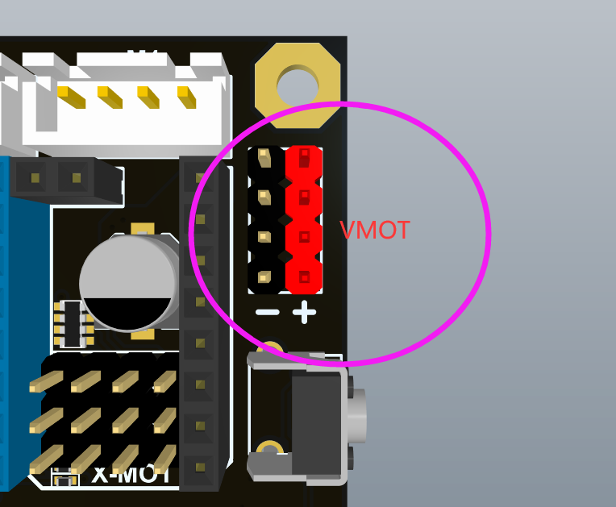
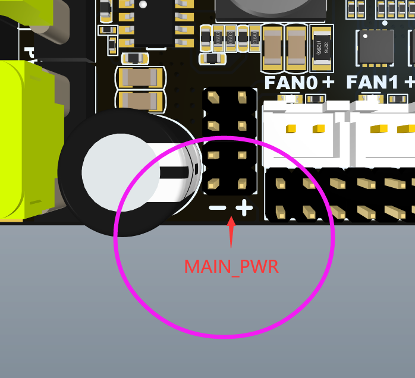

近期，关于3.3V的故障，有一些客户提出了一些新的想法，如果你有兴趣的话，可以尝试。这样以给我们提供一些反馈数据，这有助于我们做进一步的判断。

原因：3.3v 烧毁问题有可能是主板残留电能导致。

分析：蜘蛛主板上前端（MAIN_PWR）有一颗 470uF 的大电容，并且每个驱动位置（VMOT）有 100uF 的电容（共计8个），VMOT 与 MAIN_PWR 通过二极管连接。工厂测试时，主板通电，直止所有功能测完后断电。
此时主板上仍然有储存的电能存在，MAIN_PWR 的电能可以通过相连的LED等外设消耗掉，但是由于二极管的存在，VMOT的电能没有外接设备进行消耗，可能会存在很长时间（不确定多长）。
而且有的客户拿到板子后，会先不插驱动上电，检查过后，再插上驱动，然后上电，这样一个过程会再次储存电能，并且没有足够的时间使得电能释放。
这种情况下，驱动的插入，相当于是带着电能操作，有很大的概率会烧掉驱动（2209的额定电压本来就低）。

纠正做法：在插入驱动之前将主板的电能都放掉。
1.彻底断掉主板电源（完全去掉接线），等待 24v、5v和3.3v的LED完全熄灭。
2.用一个 100K 电阻（或者导线）接 MAIN_PWR 的 +/- 极。
3.用一个 100K 电阻（或者导线）接 VMOT 的 +/- 极。
4.等待5-10分钟，插上驱动，进行固件等操作。

Recently, some customers have put forward some new ideas about the 3.3V failure. I recommend you can try it before you power up your spider. Glad that you can provide us with some feedback, which will help us to make further judgments.

Reason: 3.3v burning problem may be caused by residual power on the motherboard.

Analysis: The front end (`MAIN_PWR`) on the spider motherboard has a large capacitor of `470uF`, and each drive position (`VMOT`) has a capacitor of `100uF` (a total of 8). `VMOT` and `MAIN_PWR` are connected through a diode. During the factory test, the main board is powered on, and the power is turned off after all functions are tested.
At this time, there is still stored electrical energy on the motherboard. The electrical energy of `MAIN_PWR` can be consumed by peripherals such as connected LEDs. However, due to the existence of diodes, the electrical energy of `VMOT` is not consumed by external devices and may exist for a long time (not sure how long).
Moreover, after some customers get the board, they will power on without plugging in the driver. After checking, plug in the driver and then power on. Such process will store electrical energy again, and there is not enough time for the electrical energy to be released.
In this case, the insertion of the stepper driver is equivalent to operating with electrical energy, and there is a high probability that the stepper driver will be burned (the rated voltage of the 2209 is inherently low).

Corrective action when you get Spider: Discharge the power of the motherboard before inserting the driver.
1. Power off the motherboard completely (remove the wiring completely), and wait for the 24v, 5v and 3.3v LEDs to be completely off.
2. Connect a 100K resistor (or a cable) to the +/- pole of `MAIN_PWR`.
3. Connect a 100K resistor (or a cable) to the +/- pole of `VMOT`.
4. Wait for 5-10 minutes, plug in the driver, and perform firmware and other operations.

