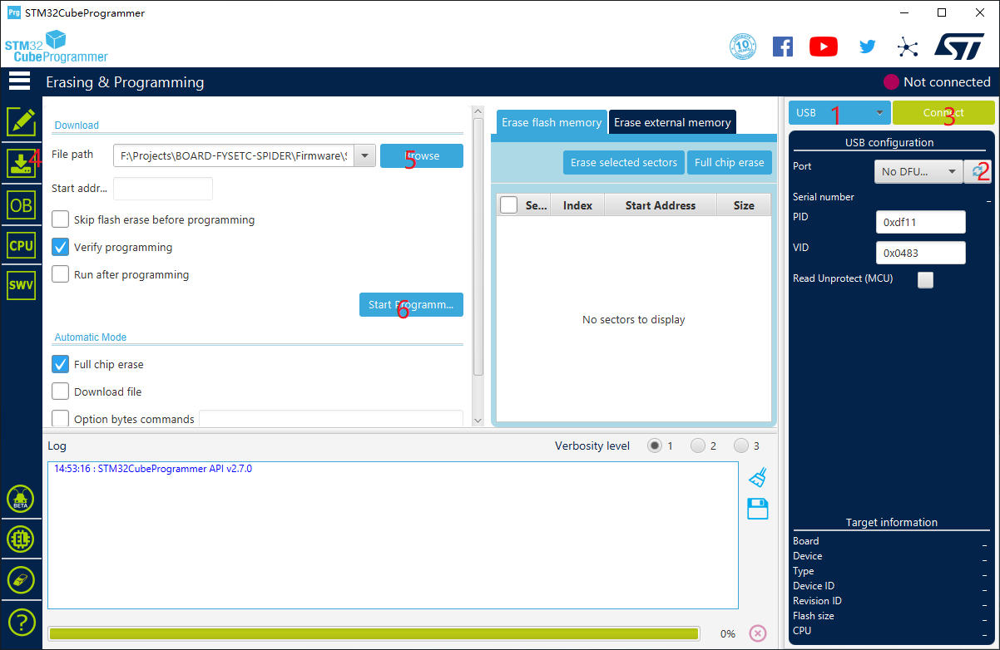

## Bootloader

**First of all, you need know that, the FYSETC Spider bootloader boot address have been change to `0x8000` since 2021/06/23. So the default bootloader `Bootloader_FYSETC_SPIDER.hex` boot address is `0x8000` or `32k`. And the old bootloader boot address is `0x10000` or `64k`, and the repo still contains it, its name is  `Bootloader_FYSETC_SPIDER_10000.hex`. So when you are going to update the bootloader, you should choose the right one.** 

You can follow the following steps to upload the bootloader to Spider.

- ##### Download stm32cubeprogrammer 

You can download it from ST website.

https://www.st.com/zh/development-tools/stm32cubeprog.html

Open the STM32CubeProgrammer software.

- ##### Enter DFU mode

1. First power off the board
2. Then close BT0 to 3.3V pin (You can find them in the middle area of the board)  with a jumper
3. Connect USB cable to the board and your computer 
4. Power up the board

Now the board is in DFU mode. 

***REMEMBER to remove the jumper if you finish uploading firmware or it will enter DFU mode again.***

- ##### Upload the bootloader

Now you can connect and flash the Spider board with STM32CubeProgrammer with the following operation.

Do as the red number shows in the screen shot.

1. Click the button to find the DFU port.
2. Connect the DFU 
3. Choose the downloaded "Bootloader-FYSETC_SPIDER.hex" file. (If old bootloader, see below, choose `Bootloader_FYSETC_SPIDER_10000.hex`). 
5. Start Programming

**We will continue to update, please look forward to it!***

**You need know that, the FYSETC Spider bootloader boot address have been change to `0x8000` since 2021/06/23. So the default bootloader `Bootloader_FYSETC_SPIDER.hex` boot address is `0x8000` or `32k`. And the old bootloader boot address is `0x10000` or `64k`, and the repo still contains it, its name is  `Bootloader_FYSETC_SPIDER_10000.hex`. So when you are going to update the bootloader, you should choose the right one.** 

## Tech Support
You can raise issue in our github https://github.com/FYSETC/FYSETC-SPIDER/issues
Or submit any technical issue into our [forum](http://forum.fysetc.com/) 