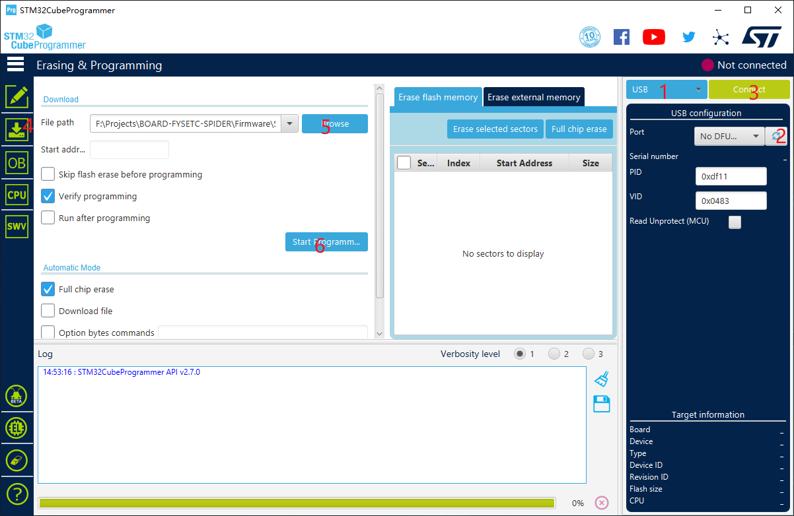

# Bootloader

Bootloader 即引导程序，是放置在主控存储 flash 空间开头一段的代码，主要作用是使主板具有卡刷的功能。由于历史原因，我们提供了两个版本的 bootloader(引导程序)，分别是 32k bootloader `Bootloader_FYSETC_SPIDER.hex` 和 64k bootloader `Bootloader_FYSETC_SPIDER_10000.hex`，

但是从 2021/06/23 起，64k bootloader 不再使用，新蜘蛛主板出厂自带 32k bootloader。但因为旧主板 (2021/06/23前出厂的) 出厂自带的是 64k bootloader，所以为了兼容，还是提供了 64k 的 bootloader. 推荐旧主板可以按下面的说明更新为 32k bootloader.

我们提供两种方法来上传 bootloader.

## 方法 1 : DFU 方式

这个方式只适用于 windows 系统。

### 第一步. 下载 stm32cubeprogrammer 

可以在 ST 的官网上下载这个软件

https://www.st.com/zh/development-tools/stm32cubeprog.html

下载完打开 STM32CubeProgrammer 软件，如下图.


### 第二步. 进入 DFU 模式


1. 首先断开电源
2. 用跳线帽短接 5V 管脚和 DC5V 

3. 用跳线帽短接 BT0 和 3.3V  

4. 用 USB 线连接主板和你的电脑

5. 上电 24v

  现在主板已经在 DFU 模式了，如果没有请按一下蜘蛛的复位按钮. 除了 24V 供电，也可以用 USB 5V 供电，不过在上述2步时跳线帽需要短接 5V 管脚 和 USB5V（翻到主板背面可以看到丝印）。 

  ***烧录完成后，把 BT0 和 3.3V 跳线帽拔下***

### 第三步. 上传 bootloader


用软件来进行上传 bootloader。



根据上图所标的红色数字步骤进行操作。请确认 2 号数字左边的选项是 USB

1. 点击刷新按钮刷出更新用的 USB 口
2. 点击 Connect 按钮
3. 选择本目录中 bootloader （32k bootloader `Bootloader-FYSETC_SPIDER.hex` 或 64k bootloader `Bootloader_FYSETC_SPIDER_10000.hex`，具体选哪个请看本文开头说明）
4. 点击 `Start Programming` 。

## 方法 2: dfu-util 方式

dfu-util方式只适用于 linux 系统，树莓派系统也是一个 linux 系统，所以也是适用的。请按下面的步骤来烧录。

***根据有些客户反馈，一些人没办法用USB连接主板和树莓派，如果遇到这种情况，请用方法1***

### 第一步：进入 DFU 模式

1. 首先断开电源

2. 用跳线帽短接 5V 管脚和 DC5V 

3. 用跳线帽短接 BT0 和 3.3V  

4. 用 USB 线连接主板和你的电脑

5. 上电 24v

  现在主板已经在 DFU 模式了，如果没有请按一下蜘蛛的复位按钮. 除了 24V 供电，也可以用 USB 5V 供电，不过在上述2步时跳线帽需要短接 5V 管脚 和 USB5V（翻到主板背面可以看到丝印）。 

  ***烧录完成后，把 BT0 和 3.3V 跳线帽拔下***

### 第二步：安装 dfu-util 软件

进入 DFU 模式之后，确认 dfu-util 软件安装好，可以用 `dfu-util --version` 命令进行查看，如果有以下类似的输出，则说明 dfu-util 安装好了。

```
dfu-util 0.9

Copyright 2005-2009 Weston Schmidt, Harald Welte and OpenMoko Inc.
Copyright 2010-2016 Tormod Volden and Stefan Schmidt
This program is Free Software and has ABSOLUTELY NO WARRANTY
Please report bugs to http://sourceforge.net/p/dfu-util/tickets/
```

如果没有的话，就需要先安装这个软件，用以下的命令进行安装。

```
sudo apt-get install dfu-util
```

### 第三步：上传 bootloader

然后发送 `dfu-util --list` 命令，确认主板被检测到，会出现如下内容。

```
<snip>
Found DFU: [0483:df11] ver=2200, devnum=13, cfg=1, intf=0, path="1-1.3", alt=3, name="@Device Feature/0xFFFF0000/01*004 e", serial="STM32FxSTM32"
Found DFU:<snip>
```

用下面命令下载 bootloader, 默认命令是下载 32k bootloader，如果你想要 64k bootloader，请把命令中的文件名`Bootloader_FYSETC_SPIDER.hex` 改为  `Bootloader_FYSETC_SPIDER_10000.hex`.

```
wget https://github.com/FYSETC/FYSETC-SPIDER/raw/main/bootloader/Bootloader_FYSETC_SPIDER.hex
```

最后用下面的命令上传 bootloader

```
objcopy --input-target=ihex --output-target=binary Bootloader_FYSETC_SPIDER.hex Bootloader_FYSETC_SPIDER.bin && dfu-util -a 0 -s 0x08000000:mass-erase:force -D Bootloader_FYSETC_SPIDER.bin
```

## 技术支持

可以到我们 github https://github.com/FYSETC/FYSETC-SPIDER/issues 提交问题。
或者把问题提交到我们[论坛](http://forum.fysetc.com/)。