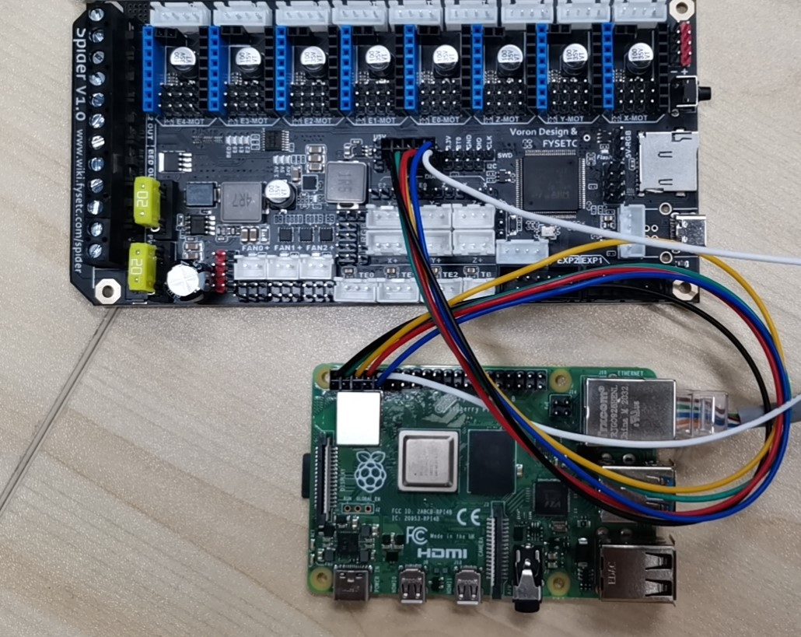

# Switch RPI hardware uart

如果你想要通过串口来连接蜘蛛和树莓派，你需要完成以下几个步骤。

## Step 1 : 接线

请按照下图进行接线。



## Step 2 : raspberryPI uart 设置

有两种方法来完成

### 方法 1

`SSH` 进你的树莓派。然后编辑 `/boot/config.txt` 文件.

```
sudo nano /boot/cmdline.txt
```

移除文件中的 "console=serial0,115200" 或者 "console=ttyAMA0,115200" 部分，然后保存退出。

```
sudo reboot
```

再次 `SSH` 进树莓派系统。

```
sudo raspi-config
```

=> Interfacing Option

=> Serial

=> NO

=> YES

=> Ok

=> Finish

=> Yes

然后重启树莓派，并再次`SSH`进树莓派系统。

```
sudo nano /boot/config.txt
```

然后把下面这行添加到文件的末尾，并保存退出。

```
dtoverlay=pi3-disable-bt
```

再次重启即可。

```
sudo reboot
```

### 方法 2

这个方法社区成员贡献出来的，没有完全的测试好。请谨慎使用。

```
sudo raspi-config nonint do_serial 2 
echo dtoverlay=pi3-disable-bt | sudo tee -a /boot/config.txt 
sudo reboot 
```

