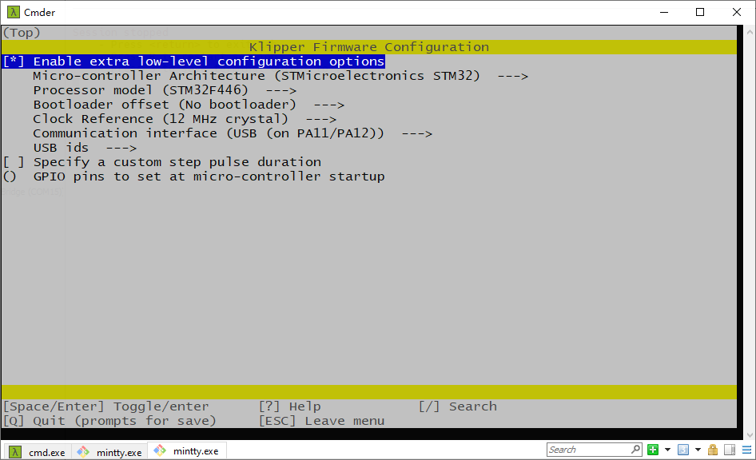
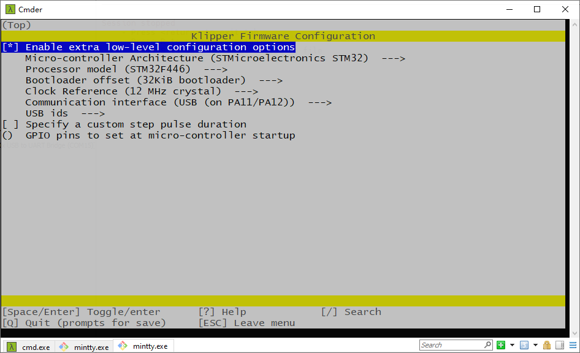
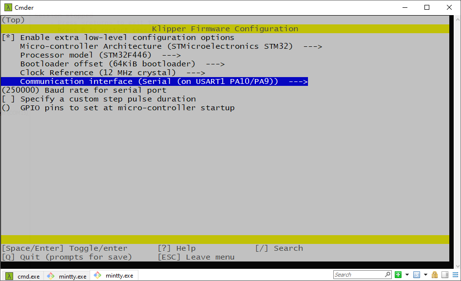

# Klipper

## printer.cfg

This in folder, there a `printer.cfg` file, this is an example Klipper configuration file for VORON2.4 machine. It is not copy-paste available config, you need to adjust the items in file, please read the file carefully, especially the first lines in the file. You need to change the items according to your machine.

```\
## *** THINGS TO CHANGE/CHECK: ***
## Spider version                       Please round search 'Spider', you need to choose Spider v1.x or v2.x pins define
## MCU paths                            [mcu] section
## Thermistor types                     [extruder] and [heater_bed] sections - See 'sensor types' list at end of file
## Z Endstop Switch location            [safe_z_home] section
## Homing end position                  [gcode_macro G32] section
## Z Endstop Switch  offset for Z0      [stepper_z] section
## Probe points                         [quad_gantry_level] section
## Min & Max gantry corner postions     [quad_gantry_level] section
## PID tune                             [extruder] and [heater_bed] sections
## Fine tune E steps                    [extruder] section
```

## Connect RPI UART

Please follow instruction here([github](https://github.com/FYSETC/FYSETC-SPIDER/blob/main/firmware/Klipper/Connect%20RPI%20uart.md) [gitee](https://gitee.com/fysetc/FYSETC-SPIDER/blob/main/firmware/Klipper/Connect%20RPI%20uart.md)).

## Pre-builds

For some beginners of Spider, i pre-build some firmwares for you, but i strongly recommend you to build the firmware yourself as Klipper update from time to time.  

`klipper-USB.bin` : No bootloader offset, choose USB to communicate with raspberrypi.



`klipper-UART.bin` : No bootloader offset, choose UART to communicate with raspberrypi.


`klipper-32k-USB.bin` : `0x8000(32k)` bootloader offset, choose USB to communicate with raspberrypi.



`klipper-32k-UART.bin` : `0x8000(32k)` bootloader offset, choose UART to communicate with raspberrypi.


`klipper-64k-USB.bin` : `0x10000(64k)` bootloader offset, choose USB to communicate with raspberrypi.


`klipper-64k-UART.bin` : `0x10000(64k)` bootloader offset, choose UART to communicate with raspberrypi.

