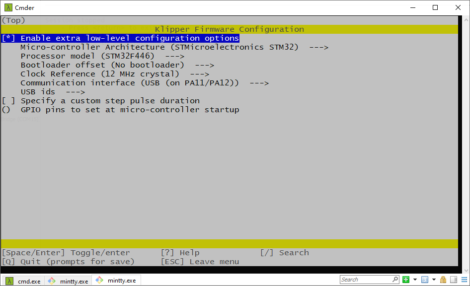
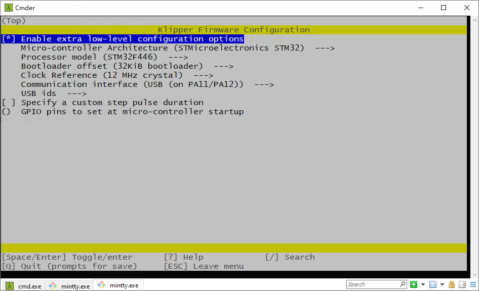
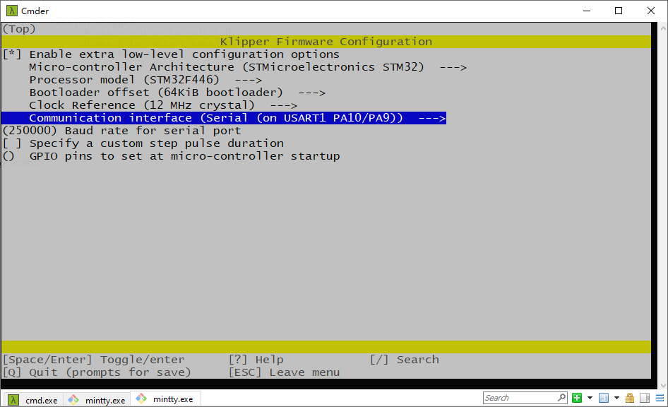

# Klipper

## printer.cfg

在这个目录中，你可以找到 `printer.cfg`文件，这是一个 VORON2.4 机器项目的配置范例。这个配置文件不是一个直接复制粘贴就能使用的文件，你需要根据你自己的机型型号及安装方式，主板接线等修改这个文件。在这个文件的开头写了你需要更改的条目，请仔细阅读。

```\
## *** THINGS TO CHANGE/CHECK: ***
## Spider version                       Please round search 'Spider', you need to choose Spider v1.x or v2.x pins define
## MCU paths                            [mcu] section
## Thermistor types                     [extruder] and [heater_bed] sections - See 'sensor types' list at end of file
## Z Endstop Switch location            [safe_z_home] section
## Homing end position                  [gcode_macro G32] section
## Z Endstop Switch  offset for Z0      [stepper_z] section
## Probe points                         [quad_gantry_level] section
## Min & Max gantry corner postions     [quad_gantry_level] section
## PID tune                             [extruder] and [heater_bed] sections
## Fine tune E steps                    [extruder] section
```

## Connect RPI uart_CN.md

这个文件教你如何配置树莓派，使其可以通过串口来连接蜘蛛。

## 预编译固件

对于一些使用蜘蛛主板的新手，我们提前编译了一些固件提供给你们使用，但是我们强烈推荐你自己编译固件，因为 Klipper 固件会不断的进行更新，我们下载的 Klipper 和你下载的 Klipper 很大可能是不同版本的，会导致版本不匹配的问题，调试机器过程中会出现莫名其妙的问题。

再详细解释下，Klipper 包含两部分，可以分别叫 A 和 B，A 跑在主板端，B 跑在树莓派等 CPU 中，由于这两部分是包含在同一个仓库中，所以两部分共享一个版本号，假设我们下载的 Klipper 是 v0.1 版本，那么两部分分别是 A v0.1 和 B v0.1 ，我们的预编译固件是通过 A v0.1 部分编译出来的固件，但是客户一般是在我们之后下载的 Klipper，那么客户的版本可能是 Klipper v0.2 版本，如果客户上传了我们用 A v0.1 版本预编译出来的固件，但是运行在树莓派等CPU端的 B 部分是 v0.2 版本的，这样就导致了版本不同，会出现莫名其妙的问题，所以最好是客户自己用 A v0.2 部分来自己编译固件，再上传，这样就不会有问题。

下面分别介绍下我们预编译固件都采用哪些编译选项及其对应需要的 bootloader。

`klipper-USB.bin` : 不需要 bootloader，选择 USB 和树莓派通信，编译选项如下图所示。



`klipper-UART.bin` : 不需要 bootloader，选择 串口和树莓派通信，编译选项如下图所示。


`klipper-32k-USB.bin` : 需要配套 32k 的 bootloader 使用，选择 USB 和树莓派通信，编译选项如下图所示。



`klipper-32k-UART.bin` : 需要配套 32k 的 bootloader 使用，选择 串口和树莓派通信，编译选项如下图所示。


`klipper-64k-USB.bin` : 需要配套 64k 的 bootloader 使用，选择 USB 和树莓派通信，编译选项如下图所示。


`klipper-64k-UART.bin` : 需要配套 64k 的 bootloader 使用，选择串口和树莓派通信，编译选项如下图所示。

