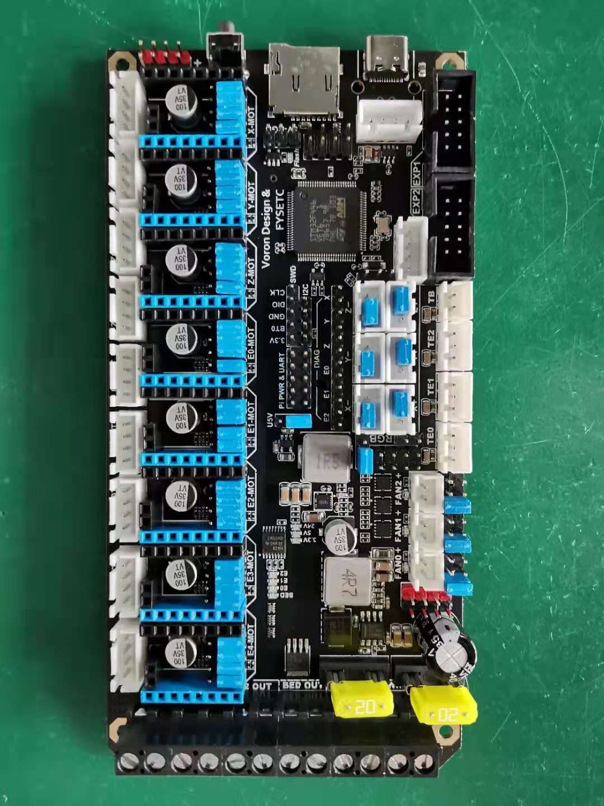
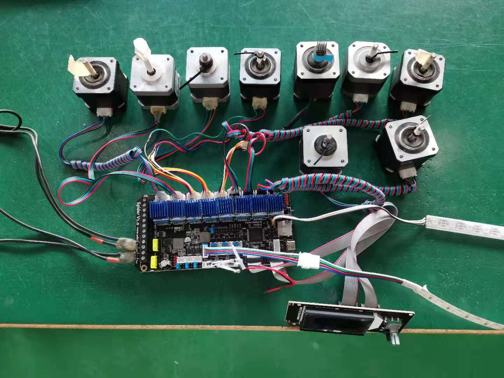
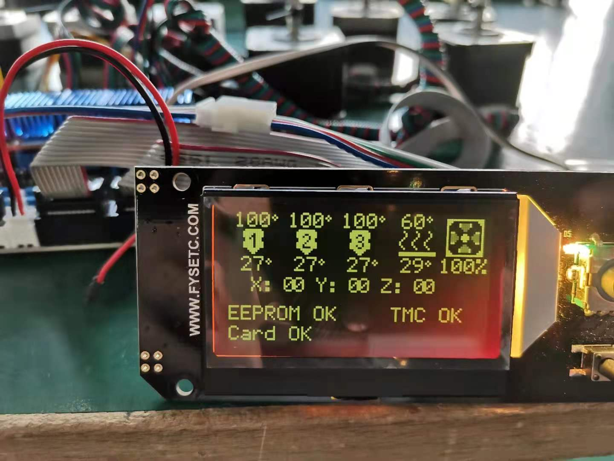

# 说明

这个文件夹中的 `test_boot.bin` ,`test_boot_8000.bin`  和 `test_no_boot.bin` 是用来测试主板用的。这些测试固件是基于 Marlin 固件的

**如果要运行这个测试固件的话，请不要把主板安装到你的机器上，免得机毁板亡~**

## 如何烧录

你有以下三个固件可以选择分别是 `test.hex`,`test_boot.bin`,`test_no_boot.bin`，对应不同的烧录. 推荐大家用 test.hex，比较简单。

### 选择 1:

`test.hex` 本身自带了 32k 的 bootloadder. 你可以不用任何操作直接上传即可。请按照这里 [github](https://github.com/FYSETC/FYSETC-SPIDER#44--firmware-upload) [gitee](https://gitee.com/fysetc/FYSETC-SPIDER#44--firmware-upload) 的说明上传固件。

### 选择 2:

`test_boot.bin` 的 boot 地址是 0x08010000 (64k) ，所以需要配套 64k 的 bootloader 使用，你需要先刷 64k bootloader. `test_boot_8000.bin` 的 boot 地址是 0x08008000 (32k),配套 32k 的 bootloader 使用，需要先刷 32k bootloader. 你需要先根据这里 [github](https://github.com/FYSETC/FYSETC-SPIDER/tree/main/bootloader)/[gitee](https://gitee.com/fysetc/FYSETC-SPIDER/tree/main/bootloader) 的说明来烧录 bootloader.然后你就可以根据这里  [[github](https://github.com/FYSETC/FYSETC-SPIDER#44--firmware-upload) [gitee](https://gitee.com/fysetc-mirrors/FYSETC-SPIDER/tree/main#44--firmware-upload)] 的说明来上传固件(在  `上传固件(SDCARD方式)` 或者`上传固件(DFU方式)` 这两章节 )。

### 选择 3:

`test_no_boot.bin` 这个测试固件，你就不需要 bootloader 了，根据这里 [github](https://github.com/FYSETC/FYSETC-SPIDER/tree/main/bootloader)/[gitee](https://gitee.com/fysetc/FYSETC-SPIDER/tree/main/bootloader) 的上传固件(DFU方式) 章节，上传固件，记得 `Start address` 填入`0x08000000`.

## 怎么使用测试固件

After you flash the test firmware, you need extra parts , list is below. Remember , all these parts are not necessary except `FYSETC mini 12864 v2.1` as the test firmware need  a display to show the test results. For other parts , you only need them when you want to test them.

你刷完测试固件之后，你还要准备下面的这些部件。记住，除了 `FYSETC mini 12864 v2.1` 之外，其他的部件都不是必须的。因为我们仅需要屏幕来显示测试结果而已。其他部件是为了测试对应功能而准备的。

| 你需要的部件                                                 |
| ------------------------------------------------------------ |
| 8*TMC2130                                                    |
| 9*stepper motors                                             |
| sdcard                                                       |
| FYSETC mini 12864 v2.1                                       |
| 100k thermistor                                              |
| ws2812 RGB strip                                             |
| 24v fans ( 你可以用 12V 风扇，不过你需要正确的用跳线帽选择好你风扇的电压) |

然后按照下图把跳线帽装好。

然后按照下图把你需要测试的部件接好。

然后给主板上电。

## 测试固件的表现

| Parts                  | How it act                        |
| ---------------------- | --------------------------------- |
| 8*TMC2130              | 会在 12864 上显示: TMC Ok or bad  |
| 步进电机               | 不断地正转和反转                  |
| sdcard                 | 会在 12864 上显示: Card Ok or bad |
| FYSETC mini 12864 v2.1 | Ok : 会有内容显示                 |
| 100k 热敏电阻          | 会在 12864 上显示温度             |
| ws2812 RGB 灯条        | 会点亮                            |
| 风扇                   | 会打开                            |
| 主板上的指示灯         | 会循环暗灭                        |

