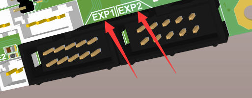
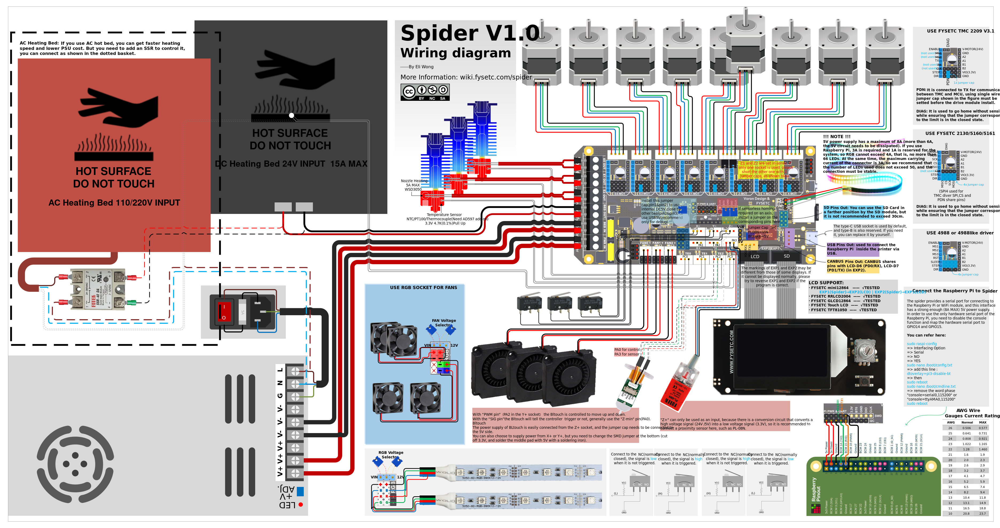
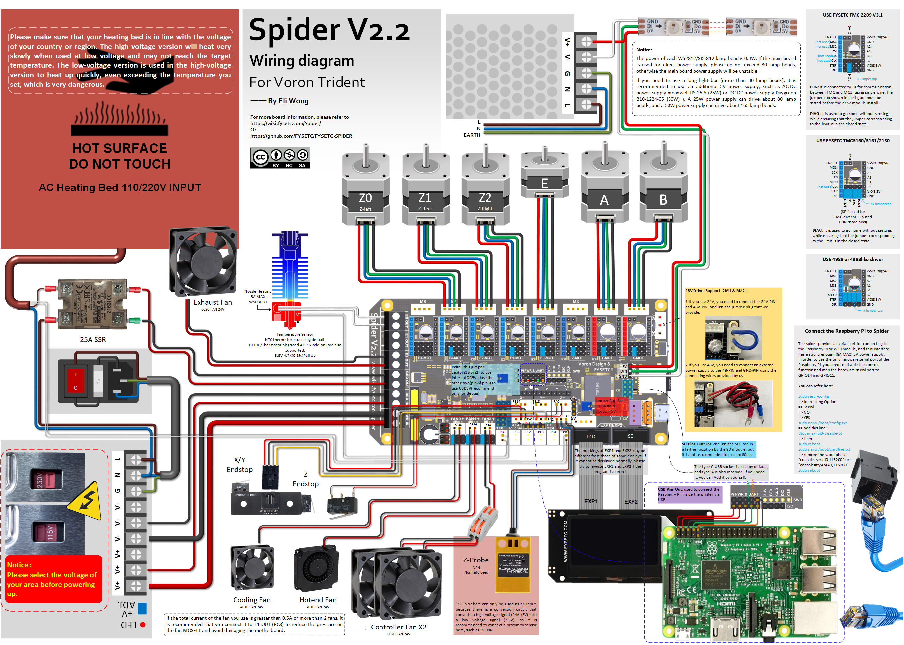
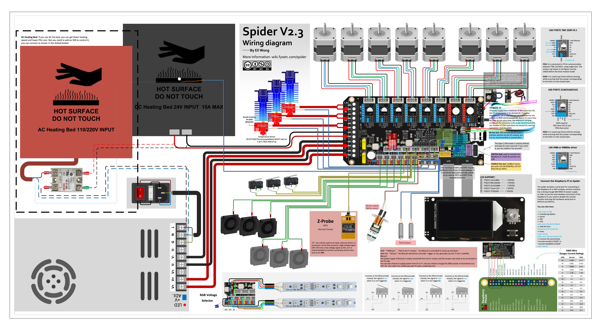
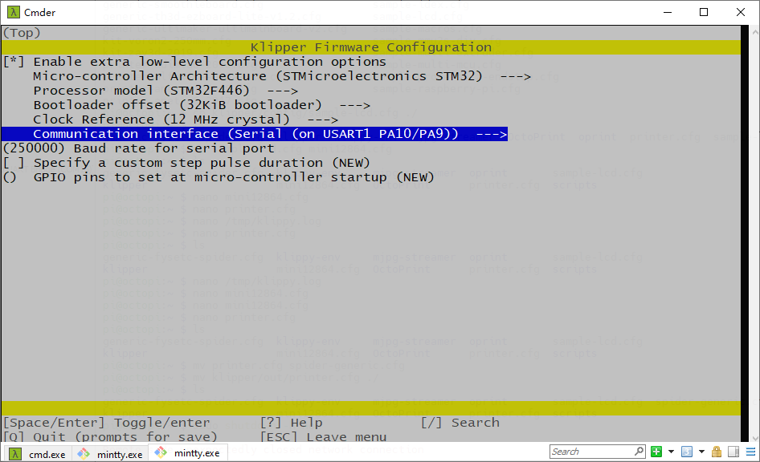
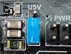
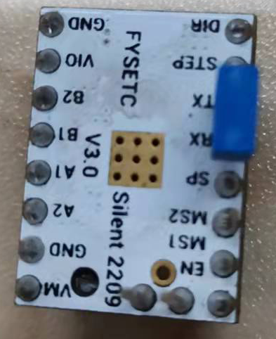
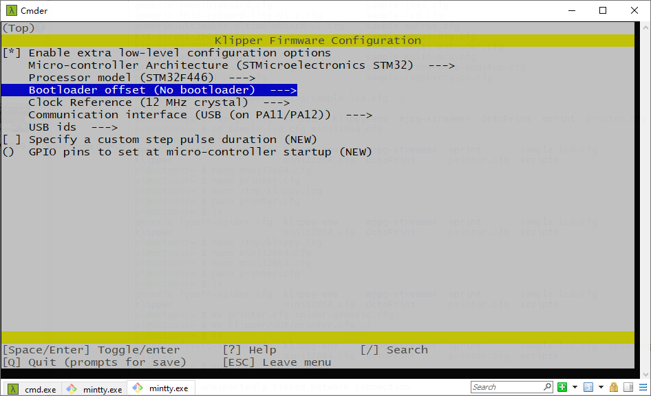

[1. 产品介绍](#1-产品介绍)

* [1.1 更改记录](#11-更改记录)
  - [1.1.1 Spider v1.1](#111-spider-v11)
  - [1.1.2 Spider v2.x](#112-spider-v2x)

[2. 特性](#2-特性)

[3. 硬件指南](#3-硬件指南)

* [3.1 Spider 接线](#31-spider-接线)
* [3.2 FYSETC mini 12864 v2.1 接线](#32-fysetc-mini-12864-v21-接线)
  * [注意/NOTICE：](#notice)
  * [接线](#接线)
* [3.3 TMC2209接线](#33-tmc2209-接线)
* [3.4 RaspberryPi 接线图](#34-raspberrypi-接线图)
* [3.5 管脚分配](#35-管脚分配)
* [3.6 管脚定义](#36-管脚定义)

[4. 固件指南](#4-固件指南)

* [4.1 Marlin 固件](#41-marlin-固件)
  - [4.1.1 下载 Vscode + platformio](#411-下载-vscode--platformio)
  - [4.1.2 下载固件](#412-下载固件)
  - [4.1.3 编译固件](#413-编译固件)
  - [4.1.4 上传固件](#414-上传固件)
* [4.2 Klipper 固件](#42-Klipper-固件)
  * [4.2.1 menuconfig 选项](#421-menuconfig-选项)
  * [4.2.2 编译固件](#422-编译固件)
  * [4.2.3 上传固件](#423-上传固件)
* [4.3 RRF](#43-rrf)
* [4.4  上传固件](#44-上传固件)
  * [4.4.1 上传固件(TF卡方式)](#441-上传固件(TF卡方式))
  * [4.4.2 上传固件(dfu-util方式)](#442-上传固件(dfu-util方式))
  * [4.4.3 上传固件(DFU方式)](#443-上传固件(dfu方式))
    * [第一步. 下载 stm32cubeprogrammer](#step-1-下载-stm32cubeprogrammer)
    * [第二步. 进入 DFU 模式](#第二步.-进入-DFU-模式)
    * [第三步. 上传固件](#第三步.-上传固件)

[5. 问题指引](#5-问题指引)

- [5.1 Spider 3.3v 问题](#51-spider-33v-问题)
- [5.2 TMC2209 报错](#52-tmc2209-报错)

[6. 购买链接](#6-购买链接)

[7. 技术支持](#7-技术支持)

[8. 相关文章](#8-相关文章)


# 1. 产品介绍

SPIDER 是一款小巧功能强大的 3D 打印机控制板。 在有限的空间内，集成了8个步进电机驱动器、5A 12V电源、8A 5V电源，为各种电压的风扇、各种RGB灯带和树莓派提供强大的支持。您可以通过 SPIDER 组装功能丰富的 3D 打印机。比如VORON V2.4，我们在设计初期就与VORON团队合作，很多功能都得到了VORON团队的认可。 如果您正在组装 VORON，这将是您的最佳选择。

## 1.1 更改记录

### 1.1.1 Spider v1.1 

- 增加 5 pin 的 BL-Touch 专用接口


- 将 EXP1 和 EXP2 的丝印调换



- 增加 +/- 丝印


- 预留树莓派 USB-A 供电端口，

  可以自行焊接一个 USB-A 端口给树莓派供电，此端口仅有供电功能，不具备USB 信号。


### 1.1.2 Spider v2.x

V2.0 

1. 支持 3路 48V 驱动。
2. 每路驱动都增加 TVS 管和限流电阻
3. 12V/5A 芯片改成 SY8205
4. 将树莓派和系统5V 电源分开（每路3A 电流）
5. 驱动改成独立 3.3v 供电
6. 改成 6 层 PCB 
7. 优化主板布线 
8. 电机驱动电路二极管改成 15A 保险丝（1808）。

V2.1 

1. 48V 驱动支持改成 2 路。
2. 12V/5A 改为 12V/3A 
3. 树莓派 5V (3A 改成 5A) and 系统 5V(5A 改成 3A ) 
4. 增加 1x2 复位端子

V2.2 

1. 增加两路热敏电阻端口，总共6路
2. 风扇 FAN0 管脚改为 PA13，FAN1 管脚改为 PA14
3. 主板背面增加管脚定义丝印

# 2. 特性

- 外观尺寸： 155.3mm x 76.5mm
- **基于 STM32F446 180Mhz 主控设计，所有 IO 都能承受 5V 电压**
- 支持**8 路 TMC 电机驱动**，支持 UART及SPI 协议
- V2.2：增加两个最大 60V 电压支持的电机驱动插座
- 改进 TMC 驱动跳线设置，更简单、更容易
- V1.0&V1.1:  最大 28V 输入，集成 12V@5A DC-DC，**5V@8A DC-DC (用于树莓派)**，3.3V@0.8A LDO
- V2.2: 最大 28V 输入，集成 12V@3A DC-DC，5V@5A DC-DC (用于树莓派)，5V@3A DC-DC ( 用于MCU 和 RGB ) , 两路 3.3V@0.8A LDO ( 用于MCU 和电机 )
- 配置两路汽车保险丝为主电源输入和热床输入提供保护
- 限位开关 24V/5V/3.3V 三级电压可选，同时支持更多的位置检测设备，如接近开关，BL-Touch 等
- XH2.54 接插件
- 10路 PWM 功率场效应管输出（1路热床，3路热端，3路风扇，3路 RGB 灯带）
- V1.0&V1.1：3 pin 温度传感器接线端子，支持热敏电阻和热电偶（需要 AD597 模块）
- V2.2: 支持最多 6 路温度传感器
- **最多 8 路 PWM 风扇输出**（在只有1个挤出头和无 RGB的情况下），支持2路 RGB 灯（12V & 24V 电压可选），**1 路 5V RGB 灯**（NEO-PIXEL / WS2812）
- 板载 RepRapDiscount SmartController 屏幕兼容接线插座
- **提供 2X5 树莓派串口及供电（5V@8A）接线端子**
- 提供用于SD 卡外接模块的 2X4 接线端子
- **板载 micro-SD 卡座**
- **Type-C 和 Type-B USB 接口可选** 
- EXP1 & EXP2 提供更多复用功能，如 USART, I2C, CAN
- 支持 SD card & USB 固件上传
- 板载温度传感器端口 4.7k 0.1% 上拉电阻，可直接接 PT1000，PT100 也可通过运放模块接入。
-  V2.2: 增加更多保护电路 （每路电机驱动增加 TVS 管，限流电阻，增加 VMOT 保险丝）

# 3. 硬件指南

我们把一些关于硬件方面的资料如原理图都放在了 `Hardware` 文件夹中，需要的可以自行查看。

## 3.1 Spider 接线

### 3.1.1 Spider v1.0 接线



### 3.1.2 Spider v1.1 接线


### 3.1.3 Spider v2.2 wiring


48v and 24v connector


#### Spider v2.2 wiring for VORON 2.4


#### Spider v2.2 wiring for VORON Trident



#### Spider v2.2 Afterburner Toolhead wiring


### 3.1.4 Spider v2.3 wiring



#### Spider v2.3 wiring for VORON 2.4


#### Spider v2.3 wiring for VORON Trident


#### Spider v2.3 Afterburner Toolhead wiring


## 3.2 FYSETC mini 12864 v2.1 接线

### 注意/NOTICE：


   为了兼容某些主板，如RAMPS1.4，FYSETC mini12864 设置了 RST(R3) 和 KILL(R4) 的可选择电阻。目前，有些主板（S6/Spider）将 KILL 换成 5V，此时，请确认FYSETC mini12864 上 R4处于空贴状态，否则按下屏幕上的按钮会致使 5V 与 GND 短路，长时间操作会导致主板损坏。<br>

  目前发现有些主板在接上 mini12864，并采用 USB 进行烧录时会导致无法烧录的情况，请去除 R1 10K 电阻。<br>

### 接线


|  |  |
| --------------------------- | --------------------------- |

## 3.3 TMC2209 接线说明


## 3.4 RaspberryPi 接线图
##### Spider 1.x, Spider 2.2


##### Spider 2.3


## 3.5 管脚分配

### 3.5.1 Spider v1.x


### 3.5.2 Spider v2.2


### 3.5.3 Spider v2.3


## 3.6 管脚定义

### 3.6.1 Spider v1.x

<table>
   <tr><td>Features</td><td>Spider Pin</td><td>STM32 Pin</td><td>Pin No.</td><td>Comment</td></tr>
   <tr><td rowspan="4">X-MOTOR(1)</td><td>X-Step</td><td>PE11</td><td>42</td><td></td></tr>
   <tr><td>X-DIR</td><td>PE10</td><td>41</td><td></td></tr>
   <tr><td>X-EN</td><td>PE9</td><td>40</td><td></td></tr>
   <tr><td>X-CS/PDN</td><td>PE7</td><td>38</td><td></td></tr>
   <tr><td rowspan="4">Y-MOTOR(2)</td><td>Y-Step</td><td>PD8</td><td>55</td><td></td></tr>
   <tr><td>Y-DIR</td><td>PB12</td><td>51</td><td></td></tr>
   <tr><td>Y-EN</td><td>PD9</td><td>56</td><td></td></tr>
   <tr><td>Y-CS/PDN</td><td>PE15</td><td>46</td><td></td></tr>
   <tr><td rowspan="4">Z-MOTOR(3)</td><td>Z-Step</td><td>PD14</td><td>61</td><td></td></tr>
   <tr><td>Z-DIR</td><td>PD13</td><td>60</td><td></td></tr>
   <tr><td>Z-EN</td><td>PD15</td><td>62</td><td></td></tr>
   <tr><td>Z-CS/PDN</td><td>PD10</td><td>57</td><td></td></tr>
   <tr><td rowspan="4">E0-MOTOR(4)</td><td>E0-Step</td><td>PD5</td><td>86</td><td></td></tr>
   <tr><td>E0-DIR</td><td>PD6</td><td>87</td><td></td></tr>
   <tr><td>E0-EN</td><td>PD4</td><td>85</td><td></td></tr>
   <tr><td>E0-CS/PDN</td><td>PD7</td><td>88</td><td></td></tr>
   <tr><td rowspan="4">E1-MOTOR(5)</td><td>E1-Step</td><td>PE6</td><td>5</td><td></td></tr>
   <tr><td>E1-DIR</td><td>PC13</td><td>7</td><td></td></tr>
   <tr><td>E1-EN</td><td>PE5</td><td>4</td><td></td></tr>
   <tr><td>E1-CS/PDN</td><td>PC14</td><td>8</td><td></td></tr>
   <tr><td rowspan="4">E2-MOTOR(6)</td><td>E2-Step</td><td>PE2</td><td>1</td><td></td></tr>
   <tr><td>E2-DIR</td><td>PE4</td><td>3</td><td></td></tr>
   <tr><td>E2-EN</td><td>PE3</td><td>2</td><td></td></tr>
   <tr><td>E2-CS/PDN</td><td>PC15</td><td>9</td><td></td></tr>
   <tr><td rowspan="4">E3-MOTOR(7)</td><td>E3-Step</td><td>PD12</td><td>39</td><td></td></tr>
   <tr><td>E3-DIR</td><td>PC4</td><td>33</td><td></td></tr>
   <tr><td>E3-EN</td><td>PE8</td><td>59</td><td></td></tr>
   <tr><td>E3-CS/PDN</td><td>PA15</td><td>77</td><td></td></tr>
   <tr><td rowspan="4">E4-MOTOR(8)</td><td>E4-Step</td><td>PE1</td><td>34</td><td></td></tr>
   <tr><td>E4-DIR</td><td>PE0</td><td>97</td><td></td></tr>
   <tr><td>E4-EN</td><td>PC5</td><td>98</td><td></td></tr>
   <tr><td>E4-CS/PDN</td><td>PD11</td><td>58</td><td></td></tr>
   <tr><td rowspan="3">TMC Driver SPI (SPI4)</td><td>MOSI</td><td>PE14</td><td>45</td><td></td></tr>
   <tr><td>MISO</td><td>PE13</td><td>44</td><td></td></tr>
   <tr><td>SCK</td><td>PE12</td><td>43</td><td></td></tr>
   <tr><td rowspan="6">End-stops</td><td>X-MIN</td><td>PB14</td><td>53</td><td>Share with X-DIAG</td></tr>
   <tr><td>X-MAX</td><td>PA1</td><td>24</td><td>Share with E0-DIAG</td></tr>
   <tr><td>Y-MIN</td><td>PB13</td><td>52</td><td>Share with Y-DIAG</td></tr>
   <tr><td>Y-MAX</td><td>PA2</td><td>25</td><td>Share with E1-DIAG</td></tr>
   <tr><td>Z-MIN</td><td>PA0</td><td>23</td><td>Share with Z-DIAG</td></tr>
   <tr><td>Z-MAX(Probe)</td><td>PA3</td><td>26</td><td>Share with E2-DIAG</td></tr>
   <tr><td rowspan="7">FAN/RGB</td><td>FAN0</td><td>PB0</td><td>35</td><td></td></tr>
   <tr><td>FAN1</td><td>PB1</td><td>36</td><td></td></tr>
   <tr><td>FAN2</td><td>PB2/BOOT1</td><td>37</td><td></td></tr>
   <tr><td>LED-R</td><td>PB6</td><td>92</td><td>Can be used for fan3</td></tr>
   <tr><td>LED-G</td><td>PB5</td><td>91</td><td>Can be used for fan4</td></tr>
   <tr><td>LED-B</td><td>PB7</td><td>93</td><td>Can be used for fan5</td></tr>
   <tr><td>5V-LED(WS2812)</td><td>PD3</td><td>84</td><td>Share with flash indicator(Bootloader)</td></tr>
   <tr><td rowspan="4">Heating</td><td>E0-Heater</td><td>PB15</td><td>54</td><td></td></tr>
   <tr><td>E1-Heater</td><td>PC8</td><td>65</td><td></td></tr>
   <tr><td>E2-Heater</td><td>PB3</td><td>89</td><td></td></tr>
   <tr><td>Heated-Bed</td><td>PB4</td><td>90</td><td></td></tr>
   <tr><td rowspan="4">Temperature</td><td>TE0（THERM0）</td><td>PC0</td><td>15</td><td>A 4.7kOhm 0.1% temperature sensor pull up resistor is used,PT1000 can be connected directly. For PT100, an amplifier board must be used.</td></tr>
   <tr><td>TE1（THERM1）</td><td>PC1</td><td>16</td><td>A 4.7kOhm 0.1% temperature sensor pull up resistor is used,PT1000 can be connected directly. For PT100, an amplifier board must be used.</td></tr>
   <tr><td>TE2（THERM2）</td><td>PC2</td><td>17</td><td>A 4.7kOhm 0.1% temperature sensor pull up resistor is used,PT1000 can be connected directly. For PT100, an amplifier board must be used.</td></tr>
   <tr><td>TB（THERM3）</td><td>PC3</td><td>18</td><td>A 4.7kOhm 0.1% temperature sensor pull up resistor is used,PT1000 can be connected directly. For PT100, an amplifier board must be used.</td></tr>
   <tr><td rowspan="8">EXP2</td><td>LCD_D7</td><td>PD1/CAN-TX1</td><td>82</td><td>Share with CAN-TX1</td></tr>
   <tr><td>LCD_D6</td><td>PD0/CAN-RX1</td><td>81</td><td>Share with CAN-RX1</td></tr>
   <tr><td>LCD_D5</td><td>PC12/MOSI3/TX5/SDA2</td><td>80</td><td></td></tr>
   <tr><td>LCD_D4</td><td>PC10/SCK3/TX3/4</td><td>78</td><td></td></tr>
   <tr><td>LCD_EN</td><td>PC11/MISO3/RX3/4</td><td>79</td><td></td></tr>
   <tr><td>LCD_RS</td><td>PD2/RX5</td><td>83</td><td></td></tr>
   <tr><td>ENC_C</td><td>PA8/SCL3</td><td>67</td><td></td></tr>
   <tr><td>BEEP</td><td>PC9/SDA3</td><td>66</td><td></td></tr>
   <tr><td rowspan="8">EXP1</td><td>RESET</td><td>NRST</td><td>14</td><td></td></tr>
   <tr><td>ENC_A</td><td>PC6/TX6</td><td>63</td><td></td></tr>
   <tr><td>ENC_B</td><td>PC7/RX6</td><td>64</td><td></td></tr>
   <tr><td>SD-DET</td><td>PB10/SCL2</td><td>47</td><td></td></tr>
   <tr><td>SD-MISO</td><td>PA6/MISO1</td><td>31</td><td></td></tr>
   <tr><td>SD-MOSI</td><td>PA7/MOSI1</td><td>32</td><td></td></tr>
   <tr><td>SCK</td><td>PA5/SCK1</td><td>30</td><td></td></tr>
   <tr><td>CS</td><td>PA4/CS1</td><td>29</td><td></td></tr>
   <tr><td rowspan="2">EEPROM(4K) I2C Pin-Out</td><td>SCL</td><td>PB8/SCL1</td><td>95</td><td>Connect to 24LC32(4K EEPROM)</td></tr>
   <tr><td>SDA</td><td>PB9/SDA1</td><td>96</td><td>Connect to 24LC32(4K EEPROM)</td></tr>
   <tr><td rowspan="2">Pi_PWR/UART</td><td>TX</td><td>PA9/TX1</td><td>68</td><td></td></tr>
   <tr><td>RX</td><td>PA10/RX1</td><td>69</td><td></td></tr>
   <tr><td rowspan="3">SWD Debug</td><td></td><td>PA13/SWDIO</td><td>72</td><td>only used for debugging now and can be used for other purposes.</td></tr>
   <tr><td></td><td>PA14/SWCLK</td><td>76</td><td>only used for debugging now and can be used for other purposes.</td></tr>
</table>

### 3.6.2 Spider v2.x
<table>
   <tr><td>Features</td><td>Spider Pin</td><td>STM32 Pin</td><td>Pin No.</td><td>Comment</td></tr>
   <tr><td rowspan="4">X-MOTOR(1)</td><td>X-Step</td><td>PE11</td><td>42</td><td></td></tr>
   <tr><td>X-DIR</td><td>PE10</td><td>41</td><td></td></tr>
   <tr><td>X-EN</td><td>PE9</td><td>40</td><td></td></tr>
   <tr><td>X-CS/PDN</td><td>PE7</td><td>38</td><td></td></tr>
   <tr><td rowspan="4">Y-MOTOR(2)</td><td>Y-Step</td><td>PD8</td><td>55</td><td></td></tr>
   <tr><td>Y-DIR</td><td>PB12</td><td>51</td><td></td></tr>
   <tr><td>Y-EN</td><td>PD9</td><td>56</td><td></td></tr>
   <tr><td>Y-CS/PDN</td><td>PE15</td><td>46</td><td></td></tr>
   <tr><td rowspan="4">Z-MOTOR(3)</td><td>Z-Step</td><td>PD14</td><td>61</td><td></td></tr>
   <tr><td>Z-DIR</td><td>PD13</td><td>60</td><td></td></tr>
   <tr><td>Z-EN</td><td>PD15</td><td>62</td><td></td></tr>
   <tr><td>Z-CS/PDN</td><td>PD10</td><td>57</td><td></td></tr>
   <tr><td rowspan="4">E0-MOTOR(4)</td><td>E0-Step</td><td>PD5</td><td>86</td><td></td></tr>
   <tr><td>E0-DIR</td><td>PD6</td><td>87</td><td></td></tr>
   <tr><td>E0-EN</td><td>PD4</td><td>85</td><td></td></tr>
   <tr><td>E0-CS/PDN</td><td>PD7</td><td>88</td><td></td></tr>
   <tr><td rowspan="4">E1-MOTOR(5)</td><td>E1-Step</td><td>PE6</td><td>5</td><td></td></tr>
   <tr><td>E1-DIR</td><td>PC13</td><td>7</td><td></td></tr>
   <tr><td>E1-EN</td><td>PE5</td><td>4</td><td></td></tr>
   <tr><td>E1-CS/PDN</td><td>PC14</td><td>8</td><td></td></tr>
   <tr><td rowspan="4">E2-MOTOR(6)</td><td>E2-Step</td><td>PE2</td><td>1</td><td></td></tr>
   <tr><td>E2-DIR</td><td>PE4</td><td>3</td><td></td></tr>
   <tr><td>E2-EN</td><td>PE3</td><td>2</td><td></td></tr>
   <tr><td>E2-CS/PDN</td><td>PC15</td><td>9</td><td></td></tr>
   <tr><td rowspan="4">E3-MOTOR(7)</td><td>E3-Step</td><td>PD12</td><td>39</td><td></td></tr>
   <tr><td>E3-DIR</td><td>PC4</td><td>33</td><td></td></tr>
   <tr><td>E3-EN</td><td>PE8</td><td>59</td><td></td></tr>
   <tr><td>E3-CS/PDN</td><td>PA15</td><td>77</td><td></td></tr>
   <tr><td rowspan="4">E4-MOTOR(8)</td><td>E4-Step</td><td>PE1</td><td>34</td><td></td></tr>
   <tr><td>E4-DIR</td><td>PE0</td><td>97</td><td></td></tr>
   <tr><td>E4-EN</td><td>PC5</td><td>98</td><td></td></tr>
   <tr><td>E4-CS/PDN</td><td>PD11</td><td>58</td><td></td></tr>
   <tr><td rowspan="3">TMC Driver SPI (SPI4)</td><td>MOSI</td><td>PE14</td><td>45</td><td></td></tr>
   <tr><td>MISO</td><td>PE13</td><td>44</td><td></td></tr>
   <tr><td>SCK</td><td>PE12</td><td>43</td><td></td></tr>
   <tr><td rowspan="6">End-stops</td><td>X-MIN</td><td>PB14</td><td>53</td><td>Share with X-DIAG</td></tr>
   <tr><td>X-MAX</td><td>PA1</td><td>24</td><td>Share with E0-DIAG</td></tr>
   <tr><td>Y-MIN</td><td>PB13</td><td>52</td><td>Share with Y-DIAG</td></tr>
   <tr><td>Y-MAX</td><td>PA2</td><td>25</td><td>Share with E1-DIAG</td></tr>
   <tr><td>Z-MIN</td><td>PA0</td><td>23</td><td>Share with Z-DIAG</td></tr>
   <tr><td>Z-MAX(Probe)</td><td>PA3</td><td>26</td><td>Share with E2-DIAG</td></tr>
   <tr><td rowspan="7">FAN/RGB</td><td>FAN0</td><td>PA13</td><td>72</td><td></td></tr>
   <tr><td>FAN1</td><td>PA14</td><td>76</td><td></td></tr>
   <tr><td>FAN2</td><td>PB2/BOOT1</td><td>37</td><td></td></tr>
   <tr><td>LED-R</td><td>PB6</td><td>92</td><td>Can be used for fan3</td></tr>
   <tr><td>LED-G</td><td>PB5</td><td>91</td><td>Can be used for fan4</td></tr>
   <tr><td>LED-B</td><td>PB7</td><td>93</td><td>Can be used for fan5</td></tr>
   <tr><td>5V-LED(WS2812)</td><td>PD3</td><td>84</td><td>Share with flash indicator(Bootloader)</td></tr>
   <tr><td rowspan="4">Heating</td><td>E0-Heater</td><td>PB15</td><td>54</td><td></td></tr>
   <tr><td>E1-Heater</td><td>PC8</td><td>65</td><td></td></tr>
   <tr><td>E2-Heater</td><td>PB3</td><td>89</td><td></td></tr>
   <tr><td>Heated-Bed</td><td>PB4</td><td>90</td><td></td></tr>
   <tr><td rowspan="6">Temperature</td><td>TE0（THERM0）</td><td>PC0</td><td>15</td><td>A 4.7kOhm 0.1% temperature sensor pull up resistor is used,PT1000 can be connected directly. For PT100, an amplifier board must be used.</td></tr>
   <tr><td>TE1（THERM1）</td><td>PC1</td><td>16</td><td>A 4.7kOhm 0.1% temperature sensor pull up resistor is used,PT1000 can be connected directly. For PT100, an amplifier board must be used.</td></tr>
   <tr><td>TE2（THERM2）</td><td>PC2</td><td>17</td><td>A 4.7kOhm 0.1% temperature sensor pull up resistor is used,PT1000 can be connected directly. For PT100, an amplifier board must be used.</td></tr>
   <tr><td>TE3（THERM3）</td><td>PC3</td><td>18</td><td>A 4.7kOhm 0.1% temperature sensor pull up resistor is used,PT1000 can be connected directly. For PT100, an amplifier board must be used.</td></tr>
   <tr><td>TE4（THERM4）</td><td>PB1</td><td>36</td><td>A 4.7kOhm 0.1% temperature sensor pull up resistor is used,PT1000 can be connected directly. For PT100, an amplifier board must be used.</td></tr>
   <tr><td>TB（THERM3）</td><td>PB0</td><td>35</td><td>A 4.7kOhm 0.1% temperature sensor pull up resistor is used,PT1000 can be connected directly. For PT100, an amplifier board must be used.</td></tr>
   <tr><td rowspan="8">EXP2</td><td>LCD_D7</td><td>PD1/CAN-TX1</td><td>82</td><td>Share with CAN-TX1</td></tr>
   <tr><td>LCD_D6</td><td>PD0/CAN-RX1</td><td>81</td><td>Share with CAN-RX1</td></tr>
   <tr><td>LCD_D5</td><td>PC12/MOSI3/TX5/SDA2</td><td>80</td><td></td></tr>
   <tr><td>LCD_D4</td><td>PC10/SCK3/TX3/4</td><td>78</td><td></td></tr>
   <tr><td>LCD_EN</td><td>PC11/MISO3/RX3/4</td><td>79</td><td></td></tr>
   <tr><td>LCD_RS</td><td>PD2/RX5</td><td>83</td><td></td></tr>
   <tr><td>ENC_C</td><td>PA8/SCL3</td><td>67</td><td></td></tr>
   <tr><td>BEEP</td><td>PC9/SDA3</td><td>66</td><td></td></tr>
   <tr><td rowspan="8">EXP1</td><td>RESET</td><td>NRST</td><td>14</td><td></td></tr>
   <tr><td>ENC_A</td><td>PC6/TX6</td><td>63</td><td></td></tr>
   <tr><td>ENC_B</td><td>PC7/RX6</td><td>64</td><td></td></tr>
   <tr><td>SD-DET</td><td>PB10/SCL2</td><td>47</td><td></td></tr>
   <tr><td>SD-MISO</td><td>PA6/MISO1</td><td>31</td><td></td></tr>
   <tr><td>SD-MOSI</td><td>PA7/MOSI1</td><td>32</td><td></td></tr>
   <tr><td>SCK</td><td>PA5/SCK1</td><td>30</td><td></td></tr>
   <tr><td>CS</td><td>PA4/CS1</td><td>29</td><td></td></tr>
   <tr><td rowspan="2">EEPROM(4K) I2C Pin-Out</td><td>SCL</td><td>PB8/SCL1</td><td>95</td><td>Connect to 24LC32(4K EEPROM)</td></tr>
   <tr><td>SDA</td><td>PB9/SDA1</td><td>96</td><td>Connect to 24LC32(4K EEPROM)</td></tr>
   <tr><td rowspan="2">Pi_PWR/UART</td><td>TX</td><td>PA9/TX1</td><td>68</td><td></td></tr>
   <tr><td>RX</td><td>PA10/RX1</td><td>69</td><td></td></tr>
   <tr><td rowspan="3">SWD Debug</td><td></td><td>PA13/SWDIO</td><td>72</td><td>only used for debugging now and can be used for other purposes.</td></tr>
   <tr><td></td><td>PA14/SWCLK</td><td>76</td><td>only used for debugging now and can be used for other purposes.</td></tr>
</table>
# 4. 固件指南

蜘蛛主板支持 Marlin 固件，Klipper 固件，RRF 固件，可根据需求进行选择合适的固件。

## 4.1 Marlin 固件

### 4.1.1 下载 Vscode + platformio

编译固件前，先下载 Visual Studio Code 软件并安装 platformio 插件。

### 4.1.2 下载固件

Marlin 固件在仓库中的 `firmware/Marlin` 文件夹中，此版本比较旧，最新 bugfix 版本的 marlin 固件在 [这里](https://github.com/MarlinFirmware/Marlin/tree/bugfix-2.0.x) 下载。推荐采用最新固件，部分 BUG 将在最新的固件中得到修复。下载完固件后需要修改一些宏定义，配置适用于蜘蛛主板的固件，蜘蛛主板才能工作。修改下载固件的 `configuration.h` 文件，文件一般在 `Marlin\Marlin\` 文件夹里。修改以下宏定义：

```
#define MOTHERBOARD BOARD_FYSETC_SPIDER
#define SERIAL_PORT -1
```

然后修改 `platformio.ini` 文件

`default_envs = FYSETC_S6` (如果主板中烧录的是旧的 bootloader，即偏移地址为`0x10000` 的 bootloader，需要用这个宏)

`default_envs = FYSETC_S6_8000` (如果主板中烧录的是新的 bootloader，即偏移地址为`0x8000` 的 bootloader，需要用这个宏)

提醒：从 2021/6/23 之后，蜘蛛主板的 bootloader （引导程序）改成了 `0x08008000` (`32k`) 的偏移。旧的 `0x08010000` (64k) 偏移的引导程序不再使用，具体查看  [github](https://github.com/FYSETC/FYSETC-SPIDER/tree/main/bootloader) 或者 [gitee](https://gitee.com/fysetc/FYSETC-SPIDER/tree/main/bootloader)。

### 4.1.3 编译固件

打开 `Vscode` 软件和 `platformio` 的主页面，单击 `Open Project` 按钮，选择你放置 Marlin 固件的路径。


完成以上操作后，看到 Vscode 屏幕下方的按钮。


直接点击对号“√”按钮编译。编译完成之后你可以在 `.pio\build\FYSETC_S6` 或者 `.pio\build\FYSETC_S6_8000` 文件夹下找到编译好的固件。

### 4.1.4 上传固件

根据上传固件指引点击 [这里](#jump0) 的章节指引来做。

## 4.2 Klipper 固件

关于 Klipper 的文件（如 printer.cfg 等）放在了这个仓库的 `firmware/Klipper` 文件夹中。请在文件夹中查阅 `说明文档_中文` 。在 `firmware/Klipper` 文件夹中也有我们提供的预编译固件，以及编译这些固件时使用的选项和说明，请具体去查询 `firmware/Klipper` 文件夹中的 `说明文档_中文` [github](https://github.com/FYSETC/FYSETC-SPIDER/tree/main/firmware/Klipper) [gitee](https://gitee.com/fysetc-mirrors/FYSETC-SPIDER/tree/main/firmware/Klipper).

如果使用 `Klipper` 固件，先根据 `Klipper` [这里](https://www.klipper3d.org/Installation.html) 的官方指引先下载  [Klipper](https://github.com/KevinOConnor/klipper). 下载完 Klipper 固件，需要对固件进行编译，编译之前先进行编译选项的选择来让固件适用于蜘蛛主板，以下是执行 `make menuconfig` 命令时需要选择的编译选项。

### 4.2.1 menuconfig 选项

请在编译时，给蜘蛛主板选择以下的选项，有些选项是多选的，根据自己的主板和机器的情况进行选择。

- #### Enable `extra low-level configuration options`

- #### Micro-controller Architecture

选择 `STMicroelectronics STM32`

- #### Processor model

选择 `STM32F446`

- #### Clock reference

选择 `12 MHz crystal`

- #### Bootloader offset

请选择 `32KiB bootloader` 偏移，如下图蓝色部分。2021/06/23之前的蜘蛛主板需要先刷我们提供的 `32k bootloader` 名字为 `Bootloader_FYSETC_SPIDER.hex`. 自2021/06/23 之后买的蜘蛛，不需要刷，因为出厂时蜘蛛自带 `32k bootloader` 。请根据 `bootloader` 的文件夹内的说明文档([github](https://github.com/FYSETC/FYSETC-SPIDER/tree/main/bootloader) or [gitee](https://gitee.com/fysetc/FYSETC-SPIDER/tree/main/bootloader)) 刷 bootloader。


- #### Communication interface

  这个选项有两个选择，如果使用 USB 线连接树莓派和蜘蛛主板，请查阅`1. USB (on PA11/PA12)` 说明，如果用串口线连接树莓派和蜘蛛主板，请查阅`2. Serial (on USART1 PA10/PA9)`.

- ##### 1. USB (on PA11/PA12)

如果使用 USB 线连接树莓派和蜘蛛主板，选择选项 `USB (on PA11/PA12)`


在 `printer.cfg` 中，需要如下所示来设定 serial. 我们提供了一个 VORON 2.4 的配置文件示例进行参考，在 [github](https://github.com/FYSETC/FYSETC-SPIDER/tree/main/firmware/Klipper) [gitee](https://gitee.com/fysetc-mirrors/FYSETC-SPIDER/blob/main/firmware/Klipper/printer.cfg).

```
Obtain definition by "ls -l /dev/serial/by-id/" then unplug to verify
##--------------------------------------------------------------------
serial: /dev/serial/by-id/usb-Klipper_stm32f446xx_230032000851363131363530-if00
```

- ##### 2. Serial (on USART1 PA10/PA9)

如果使用串口连接树莓派和蜘蛛，选择选项 `Serial (on USART1 PA10/PA9)`



此外在你的 `printer.cfg` 中， serial 部分需要使用如下的配置。我们提供了一个 VORON 2.4 的配置文件示例进行参考，在 [github](https://github.com/FYSETC/FYSETC-SPIDER/tree/main/firmware/Klipper) [gitee](https://gitee.com/fysetc-mirrors/FYSETC-SPIDER/blob/main/firmware/Klipper/printer.cfg).

```
serial: /dev/ttyAMA0
```

除了要修改 serial 的配置之外，你还需要根据 `Connect RPI uart_中文版.md` 说明文件配置树莓派，这个说明文件在 [github](https://github.com/FYSETC/FYSETC-SPIDER/blob/main/firmware/Klipper/) [gitee](https://gitee.com/fysetc-mirrors/FYSETC-SPIDER/tree/main/firmware/Klipper).

### 4.2.2 编译固件

```
make
```

### 4.2.3 上传固件

根据上传固件章节也就是 [这里](#jump0) 的章节指引来做。

## 4.3 RRF

由于 RRF 固件需要超过 512KB 的 flash，超过了蜘蛛所搭载的 446 主控的 flash 空间。所以我们对 RRF 固件进行了裁剪，具体查看本仓库中的 `firmware/RRF` 文件夹下的 README 说明文档 [github](https://github.com/FYSETC/FYSETC-SPIDER/tree/main/firmware/RRF) [gitee](https://gitee.com/fysetc/FYSETC-SPIDER/tree/main/firmware/RRF)。

## 4.4 <span id="jump0">上传固件</span>

提供以下几种方式上传固件。

### 4.4.1 <span id="jump1">上传固件(TF卡方式)</span>

蜘蛛主板出厂时自带 bootloader（引导程序），可以采用 TF 卡进行固件上传。Bootloader 存在损坏或被清除的情况（如把固件刷到了芯片 flash 地址 `0x08000000` ， bootloader (引导程序) 就会被清除掉，因 bootloader 占据 flash `0x08000000` 的位置），这时需要重新刷 bootloader（引导程序），请根据 这里([github](https://github.com/FYSETC/FYSETC-SPIDER/tree/main/bootloader) [gitee](https://gitee.com/fysetc/FYSETC-SPIDER/tree/main/bootloader)) 的 README 说明文件重新刷 bootloader。

用 TF 进行固件更新，只需要把你编译好的 `firmware.bin` 文件（如果是 klipper 固件的话，默认生成 `klipper.bin` 你需要把 `klipper.bin` 改名成 `firmware.bin`）拷贝到你的 TF 卡中，插入蜘蛛主板的 TF 卡槽中，给蜘蛛上电。指示灯开始闪烁表示开始烧录，TF 卡旁边的指示灯不再闪烁即烧录完成。拔下 TF 卡，然后插到电脑上，你会发现 `firmware.bin` 被重新命名为 `old.bin`，说明烧录成功。如果名称不变，说明没有烧录成功。

### 4.4.2 <span id="jump4">上传固件(dfu-util方式)</span>

dfu-util方式只适用于 linux 系统，树莓派系统也是一个 linux 系统，所以也是适用的。请按下面的步骤来烧录。

#### 第一步：进入 DFU 模式

1. 首先断开电源

2. 用跳线帽短接 5V 管脚和 DC5V 

3. 用跳线帽短接 BT0 和 3.3V  

4. 用 USB 线连接主板和你的电脑（或者树莓派）

5. 上电 24v

  现在主板已经在 DFU 模式了，如果没有请按一下蜘蛛的复位按钮. 除了 24V 供电，也可以用 USB 5V 供电，不过在上述2步时跳线帽需要短接 5V 管脚 和 USB5V（翻到主板背面可以看到丝印）。 

  ***烧录完成后，把 BT0 和 3.3V 跳线帽拔下***

#### 第二步：安装 dfu-util 软件

进入 DFU 模式之后，确认 dfu-util 软件安装好，可以用 `dfu-util --version` 命令进行查看，如果有以下类似的输出，则说明 dfu-util 安装好了。

```
dfu-util 0.9

Copyright 2005-2009 Weston Schmidt, Harald Welte and OpenMoko Inc.
Copyright 2010-2016 Tormod Volden and Stefan Schmidt
This program is Free Software and has ABSOLUTELY NO WARRANTY
Please report bugs to http://sourceforge.net/p/dfu-util/tickets/
```

如果没有的话，就需要先安装这个软件，用以下的命令进行安装。

```
sudo apt-get install dfu-util
```

#### 第三步：发送上传命令

使用下列命令上传固件。但此之前，需要根据固件和bootloader 的情况，调整这个命令。如果是 klipper 固件，生成的固件一般在 out/klipper 把以下命令中的 `firmware.bin` 改成 `out/klipper.bin`，支持 hex 格式如 firmware.hex . 根据自己主板的 bootloader 的情况改变命令中的 `0x08008000` 部分。例如你采用的是 Marlin 固件，env 设定为 `default_envs = FYSETC_S6` ，那么你需要把命令中的 `0x08008000` 改成`0x08010000`，如果 env 是 `default_envs = FYSETC_S6_8000`，则不需要修改。如果你用的是 klipper 固件，并且 make menuconfig 的时候如果选择了 `No bootloader`, 需要把命令中的 `0x08008000` 改成`0x08000000`，如果选择了 `32kiB bootloader`，则不需要更改，如果选择了 `64KiB bootloader`, 需要把 `0x08008000` 改成`0x08010000`，如果是 hex 文件需要把 `0x08008000` 改成`0x08000000`.

```
dfu-util -R -a 0 -s 0x08008000:leave -D firmware.bin
```

### 4.4.3 <span id="jump">上传固件(DFU方式)</span>

这个方式只适用于 windows 系统。

#### 第一步. 下载 stm32cubeprogrammer 

可以在 ST 的官网上下载这个软件

https://www.st.com/zh/development-tools/stm32cubeprog.html

下载完打开 STM32CubeProgrammer 软件，如下图.


#### 第二步. 进入 DFU 模式

1. 首先断开电源
2. 然后用跳线帽短接 5v 管脚 和 DC5V 
3. 然后用跳线帽短接 BT0 和 3.3V  
4. 然后用 USB 线连接主板和你的电脑
5. 然后上电 24v

现在主板已经在 DFU 模式了，如果没有请按一下蜘蛛的复位按钮. 除了 24V 供电，也可以用 USB 5V 供电，不过在上述2步时跳线帽需要短接 5V 管脚 和 USB5V（翻到主板背面可以看到丝印）。 

***当你完成烧录后，请记得把 BT0 和 3.3V 跳线帽拔下***

#### 第三步. 上传固件

用软件来进行烧录固件。


根据上图所标的红色数字步骤进行操作。请确认 2 号数字左边的选项是 USB

1. 点击刷新按钮刷出更新用的 USB 口
2. 点击 Connect 按钮
3. 选择你编译好的固件 .bin 后缀的文件 （或者 hex 文件）
4. 填 写`Start address`. 根据 bootloader 的情况，调整这个框。例如你采用的是 Marlin 固件，然后 env 设定为 `default_envs = FYSETC_S6` ，那么你需要填写`0x08010000`，如果 env 是 `default_envs = FYSETC_S6_8000`，则填 `0x08008000`。如果你用的是 klipper 固件，并且 make menuconfig 的时候选择了 `No bootloader`，则填 `0x08000000`，选择了 `32kiB bootloader`，则填 `0x08008000`，如果选择了 `64KiB bootloader`, 需要填 `0x08010000`，如果是 hex 文件，这里不用填.
5. 点击 `Start Programming` 。

### 4.4.4 上传固件(platformio方式)

此上传方式只适合于采用 platformio 编译 Marlin 固件的情况。

#### 第一步. 进入 DFU 模式

1. 首先断开电源
2. 用跳线帽短接 5v 管脚和 DC5V 
3. 用跳线帽短接 BT0 和 3.3V  
4. 用 USB 线连接主板和你的电脑
5. 上电 24v

以上操作完毕主板已经在 DFU 模式了，如果没有请按一下蜘蛛的复位按钮. 除了 24V 供电，当然也可以用 USB 5V 供电，不过在上述2步时跳线帽需要短接 5V 管脚和 U5V（翻到主板背面可以看到丝印）。 

***当你完成烧录后，请记得把 BT0 和 3.3V 跳线帽拔下***

#### 第二步. 点击上传按钮上传固件


## 4.5 测试固件

If you suspect there is something wrong with your board, you can use our test firmware to have a test. Follow the README here ([github](https://github.com/FYSETC/FYSETC-SPIDER/tree/main/firmware/Test) [gitee](https://gitee.com/fysetc-mirrors/FYSETC-SPIDER/tree/main/firmware/Test)).

如果怀疑你的主板有问题，可以使用测试固件来进行测试。根据对应链接  ([github](https://github.com/FYSETC/FYSETC-SPIDER/tree/main/firmware/Test) [gitee](https://gitee.com/fysetc-mirrors/FYSETC-SPIDER/tree/main/firmware/Test)) 的 README 来操作。

# 5. 问题指引

### 5.1 Spider 3.3v 问题

详情请查看([github](https://github.com/FYSETC/FYSETC-SPIDER/blob/main/Spider%203.3v%20issue.md) [gitee](https://gitee.com/fysetc/FYSETC-SPIDER/blob/main/Spider%203.3v%20issue.md)).

### 5.2 TMC2209 报错

修复方法1：如下图所示，请在主板的所有 TMC2209 上用跳线帽短接RX TX管脚，然后重启机器。



修复方法2：请用如下命令来复位 TMC 驱动。

```
INIT_TMC STEPPER=<name>
```

name 请填入 `stepper_x`,`stepper_y`等在你 `printer.cfg` 文件中的定义，详情请查看 Klipper 官方[文档](https://mmone.github.io/klipper/G-Codes.html).

### 5.3 卡刷固件没有变成 old.bin

修复方法1：重新刷一遍 bootloader，方法请参考这里( github gitee)。

修复方法2：如果用的是 Klipper 固件，请使用 `No bootloader` 选项来编译 Klipper，并采用线刷方式上传固件到 `0x08000000`地址。具体请看[上传固件dfu-util方式](#jump4) 或者[上传固件DFU方式](#jump)章节。 

### 5.4 没有运行klipper/无法找到id 

请在编译 klipper 过程中选择 `No bootloader` 选项，如下图蓝色部分。这意味着不使用 bootloader（引导程序）。如果 bootloader 损坏时可以使用这个选项。上传固件请采用 [上传固件(DFU方式)](#jump) ，操作时，**你需要修改 'Start address' 为 `0x08000000`**，切记，切记. 


# 6. 购买链接

- [FYSETC](https://www.fysetc.com/products/pre-sale-fysetc-spider-v1-0-motherboard-32bit-controller-board-tmc2208-tmc2209-3d-printer-part-replace-skr-v1-3-for-voron?variant=39404109267119)
- [Taobao](https://item.taobao.com/item.htm?spm=a230r.1.14.30.511751bfpMtaWP&id=649360814769&ns=1&abbucket=18#detail)
- [Aliexpress](https://www.aliexpress.com/item/1005002324070189.html)

# 7. 技术支持
你可以到我们 github https://github.com/FYSETC/FYSETC-SPIDER/issues 提交问题，也可以发布问题到我们的[论坛](http://forum.fysetc.com/)。

# 8. 相关文章

[English](https://3dwork.io/en/complete-guide-fysetc-spider/)

[Español](https://3dwork.io/guia-completa-fysetc-spider/)
